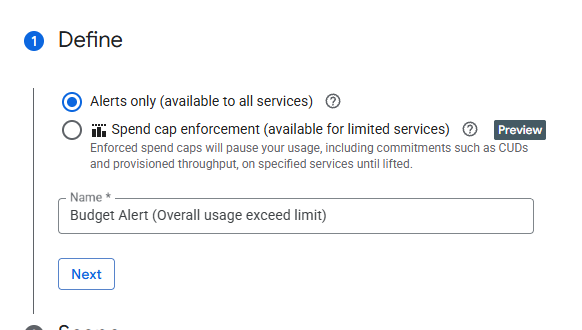
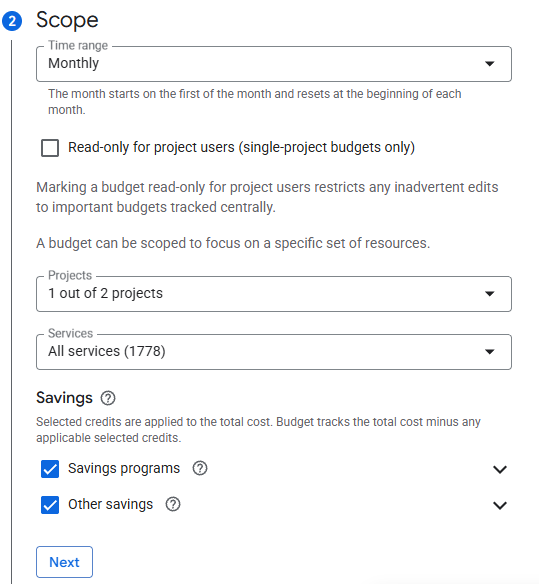
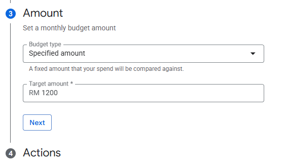
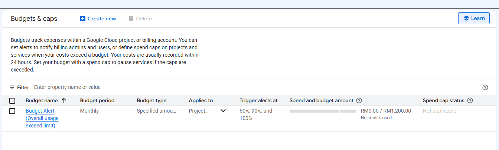

# 00. Prerequisites and Environment Setup

This document records every step taken to prepare the workstation and the GCP project before starting Task 1. Each step lists the commands run, the result, and where the raw output is stored.

## Summary

| # | Item | Status | Evidence |
|---|------|--------|----------|
| 1 | Workstation tools installed (WSL) | Done | [01-tool-versions.txt](../evidence/prerequisites/01-tool-versions.txt) |
| 2 | gcloud authenticated, project selected | Done | [02-gcloud-auth-config.txt](../evidence/prerequisites/02-gcloud-auth-config.txt), [03-project-and-billing.txt](../evidence/prerequisites/03-project-and-billing.txt) |
| 3 | Application Default Credentials for Terraform | Done | [04-adc-check.txt](../evidence/prerequisites/04-adc-check.txt) |
| 4 | Default region and zone | Done | [02-gcloud-auth-config.txt](../evidence/prerequisites/02-gcloud-auth-config.txt) |
| 5 | Budget alert | Done | Screenshots in section 5 |
| 6 | Free trial quota review | Done | [05-compute-quotas.txt](../evidence/prerequisites/05-compute-quotas.txt) |
| 7 | Required APIs enabled (Terraform) | Done | [evidence/task-1/bootstrap/](../evidence/task-1/bootstrap/) |
| 8 | Remote state bucket (Terraform) | Done | [evidence/task-1/bootstrap/](../evidence/task-1/bootstrap/) |
| 9 | Repository hygiene (.gitignore) | Done | [.gitignore](../.gitignore) |

## Environment at a glance

| Setting | Value |
|---------|-------|
| GCP project ID | `cloud-mile-assessment` |
| Project number | `969886371063` |
| Active gcloud account | `zantarockstudio@gmail.com` |
| Billing | Enabled (account ID redacted) |
| Default region / zone | `asia-southeast1` / `asia-southeast1-a` |
| Terraform state bucket | `gs://cloud-mile-assessment-tfstate` |
| Terminal | WSL (Ubuntu) on Windows 11 |

---

## 1. Workstation tools

All CLI work is done from WSL. The following tools were installed and verified:

```bash
gcloud --version
terraform version
kubectl version --client
gke-gcloud-auth-plugin --version
docker version --format '{{.Server.Version}}'
```

| Tool | Version | Used for |
|------|---------|----------|
| Google Cloud SDK | 575.0.1 | All GCP operations |
| Terraform | 1.15.8 | Infrastructure as Code (Task 1) |
| kubectl | 1.35.6 | GKE operations (Task 2 onwards) |
| gke-gcloud-auth-plugin | 0.1.0-gke.3 | kubectl authentication to GKE |
| Docker | 29.5.2 | Building the sample application image (Task 2) |

Raw output: [01-tool-versions.txt](../evidence/prerequisites/01-tool-versions.txt)

## 2. gcloud authentication and project selection

The gcloud CLI was authenticated with the sandbox account and pointed at the assessment project:

```bash
gcloud auth login
gcloud config set account zantarockstudio@gmail.com
gcloud config set project cloud-mile-assessment
```

Verification:

```bash
gcloud auth list
gcloud config list
gcloud projects describe cloud-mile-assessment
gcloud billing projects describe cloud-mile-assessment
```

Result:
- Active account is `zantarockstudio@gmail.com`.
- Project `cloud-mile-assessment` is `ACTIVE`.
- Billing is enabled on the project.

Raw output: [02-gcloud-auth-config.txt](../evidence/prerequisites/02-gcloud-auth-config.txt), [03-project-and-billing.txt](../evidence/prerequisites/03-project-and-billing.txt)

## 3. Application Default Credentials (ADC) for Terraform

`gcloud auth login` only authenticates the gcloud CLI. Terraform's Google provider reads Application Default Credentials, which are a separate login. The quota project is set so API usage is attributed to the assessment project.

```bash
gcloud auth application-default login
gcloud auth application-default set-quota-project cloud-mile-assessment
```

Verification (the token itself is not recorded):

```bash
gcloud auth application-default print-access-token > /dev/null && echo "ADC token issued successfully"
```

Raw output: [04-adc-check.txt](../evidence/prerequisites/04-adc-check.txt)

## 4. Default region and zone

```bash
gcloud config set compute/region asia-southeast1
gcloud config set compute/zone asia-southeast1-a
```

Reasons for the choice:
- `asia-southeast1` (Singapore) is the closest region, so console and kubectl round trips during the live defense stay fast.
- A single zonal GKE cluster is covered by the GKE free tier credit for cluster management fees, which keeps trial credit usage low.

## 5. Budget alert

A budget alert was created in the console under **Billing > Budgets & alerts** to catch unexpected spend before it becomes a problem.

| Setting | Value |
|---------|-------|
| Name | Budget Alert (Overall usage exceed limit) |
| Type | Alerts only |
| Time range | Monthly |
| Scope | This project (1 of 2 projects), all services |
| Savings | Savings programs and other savings included |
| Amount | RM 1,200 (specified amount) |
| Alert thresholds | 50%, 90%, 100% |

**Step 1: Define**



**Step 2: Scope**



**Step 3: Amount**



**Result: budget created**



## 6. Free trial quota review

Free trial projects have low compute quotas, which limit how large the GKE node pool can grow. The relevant quotas were checked before designing the cluster:

```bash
gcloud compute regions describe asia-southeast1 --flatten=quotas \
  --format="table(quotas.metric,quotas.usage,quotas.limit)"
gcloud compute project-info describe --flatten=quotas \
  --format="table(quotas.metric,quotas.usage,quotas.limit)"
```

| Quota | Limit | Design impact |
|-------|-------|---------------|
| `E2_CPUS` (asia-southeast1) | 8 | With e2-medium nodes (2 vCPU), the autoscaler maximum is 3 nodes (6 vCPU). A surge upgrade adds 1 more node, reaching exactly 8. |
| `CPUS_ALL_REGIONS` | 12 | No spare capacity for workloads in other regions. |
| `IN_USE_ADDRESSES` (asia-southeast1) | 4 | Private nodes use no external IPs. Cloud NAT uses 1. The Ingress load balancer IP is global and does not count here. |
| `INSTANCES` (asia-southeast1) | 8 | Not a constraint at 3 nodes. |
| `SSD_TOTAL_GB` (asia-southeast1) | 250 | Node boot disks should use `pd-balanced` or `pd-standard` sized modestly. |

Raw output: [05-compute-quotas.txt](../evidence/prerequisites/05-compute-quotas.txt)

## 7 and 8. Bootstrap: required APIs and remote state bucket

A new project only has a default set of APIs enabled, and Terraform remote state needs a GCS bucket that exists before `terraform init` can use it. Both are handled by a small, separate Terraform configuration in [terraform/bootstrap/](../terraform/bootstrap/) so that the setup is captured in code rather than done by hand.

### 7.1 What the bootstrap creates

**APIs** (`google_project_service`, with `disable_on_destroy = false` so destroying the bootstrap never disables APIs other configurations depend on):

| API | Needed for |
|-----|------------|
| `cloudresourcemanager.googleapis.com` | Project level IAM and lookups |
| `serviceusage.googleapis.com` | Managing APIs from Terraform |
| `iam.googleapis.com` | Service accounts and role bindings |
| `iamcredentials.googleapis.com` | Workload Identity token exchange |
| `compute.googleapis.com` | VPC, subnet, Cloud Router, Cloud NAT, firewall |
| `container.googleapis.com` | GKE |
| `sqladmin.googleapis.com` | Cloud SQL |
| `servicenetworking.googleapis.com` | Private IP for Cloud SQL (private services access) |
| `secretmanager.googleapis.com` | Database credentials |
| `artifactregistry.googleapis.com` | Application container image |
| `logging.googleapis.com` | Logs and log based metrics |
| `monitoring.googleapis.com` | Dashboards, alerts, uptime checks |

**State bucket** `cloud-mile-assessment-tfstate`:

| Setting | Value | Reason |
|---------|-------|--------|
| Location | `asia-southeast1` | Same region as the workload |
| Versioning | Enabled | Recover a previous state if a write goes wrong |
| Lifecycle | Keep the 10 most recent noncurrent versions | Limits storage growth |
| Uniform bucket level access | Enabled | IAM only, no object ACLs |
| Public access prevention | Enforced | State can contain sensitive values |
| `force_destroy` | `false` | Bucket cannot be deleted while it still holds state |

### 7.2 Files

| File | Purpose |
|------|---------|
| [versions.tf](../terraform/bootstrap/versions.tf) | Terraform and provider version constraints, provider config |
| [variables.tf](../terraform/bootstrap/variables.tf) | `project_id`, `region`, list of APIs |
| [main.tf](../terraform/bootstrap/main.tf) | API enablement and state bucket |
| [outputs.tf](../terraform/bootstrap/outputs.tf) | Bucket name and enabled APIs |
| [terraform.tfvars](../terraform/bootstrap/terraform.tfvars) | Project and region values (no secrets) |
| [backend.tf](../terraform/bootstrap/backend.tf) | GCS backend, added after the bucket existed |

### 7.3 Steps

**Step 1: Initialise with local state.** The bucket does not exist yet, so the first run uses local state.

```bash
cd terraform/bootstrap
terraform init
```

Raw output: [01-init.txt](../evidence/task-1/bootstrap/01-init.txt)

**Step 2: Plan.** Result: `Plan: 13 to add, 0 to change, 0 to destroy` (12 APIs and 1 bucket).

```bash
terraform plan -out=bootstrap.tfplan
```

Raw output: [02-plan.txt](../evidence/task-1/bootstrap/02-plan.txt)

**Step 3: Apply the saved plan.** Result: `Apply complete! Resources: 13 added, 0 changed, 0 destroyed.` API enablement took about 1.5 minutes.

```bash
terraform apply bootstrap.tfplan
rm -f bootstrap.tfplan
```

Raw output: [03-apply.txt](../evidence/task-1/bootstrap/03-apply.txt)

**Step 4: Move the bootstrap state into the new bucket.** `backend.tf` was added pointing at the bucket with prefix `bootstrap`, then the state was migrated. The local state files were removed afterwards so no state is left on disk.

```bash
terraform init -migrate-state -force-copy
gcloud storage ls -r gs://cloud-mile-assessment-tfstate/
rm -f terraform.tfstate terraform.tfstate.backup
```

Result: state now lives at `gs://cloud-mile-assessment-tfstate/bootstrap/default.tfstate`.

Raw output: [04-init-migrate-state.txt](../evidence/task-1/bootstrap/04-init-migrate-state.txt)

**Step 5: Confirm no drift.** A fresh plan against the remote state reported that Terraform `found no differences, so no changes are needed`, with exit code 0 (`-detailed-exitcode` returns 2 when changes are pending).

```bash
terraform plan -detailed-exitcode
```

Raw output: [07-plan-no-drift.txt](../evidence/task-1/bootstrap/07-plan-no-drift.txt)

**Step 6: Verify independently with gcloud.**

```bash
gcloud services list --enabled --format="value(config.name)" | sort
gcloud storage buckets describe gs://cloud-mile-assessment-tfstate \
  --format="yaml(name,location,versioning_enabled,uniform_bucket_level_access,public_access_prevention)"
```

Result: all required APIs listed as enabled. Bucket reports `location: ASIA-SOUTHEAST1`, `versioning_enabled: true`, `uniform_bucket_level_access: true`, `public_access_prevention: enforced`.

Raw output: [05-gcloud-services-enabled.txt](../evidence/task-1/bootstrap/05-gcloud-services-enabled.txt), [06-gcloud-tfstate-bucket.txt](../evidence/task-1/bootstrap/06-gcloud-tfstate-bucket.txt)

### 7.4 State layout

| Configuration | State location |
|---------------|----------------|
| `terraform/bootstrap` | `gs://cloud-mile-assessment-tfstate/bootstrap/` |
| Main platform (Task 1) | `gs://cloud-mile-assessment-tfstate/<separate prefix>/` |

Keeping separate prefixes means the main platform can be planned, applied, and destroyed without touching the bootstrap resources.

## 9. Repository hygiene

A [.gitignore](../.gitignore) was added before any Terraform run so that the following are never committed:
- `.terraform/` provider directories
- `*.tfstate` and `*.tfstate.*` (state can contain secrets)
- `*.tfplan` saved plans
- Credential files (`*-key.json`, `credentials*.json`, `.env`)

`.terraform.lock.hcl` is intentionally committed so every run uses the same provider versions.

---

## Next

Prerequisites are complete. Next is Task 1: VPC and subnet, Cloud Router and Cloud NAT, firewall rules, private GKE cluster with Workload Identity and autoscaling, Cloud SQL for PostgreSQL with private IP, Secret Manager, and least privilege service accounts, using the GCS remote state set up above.
