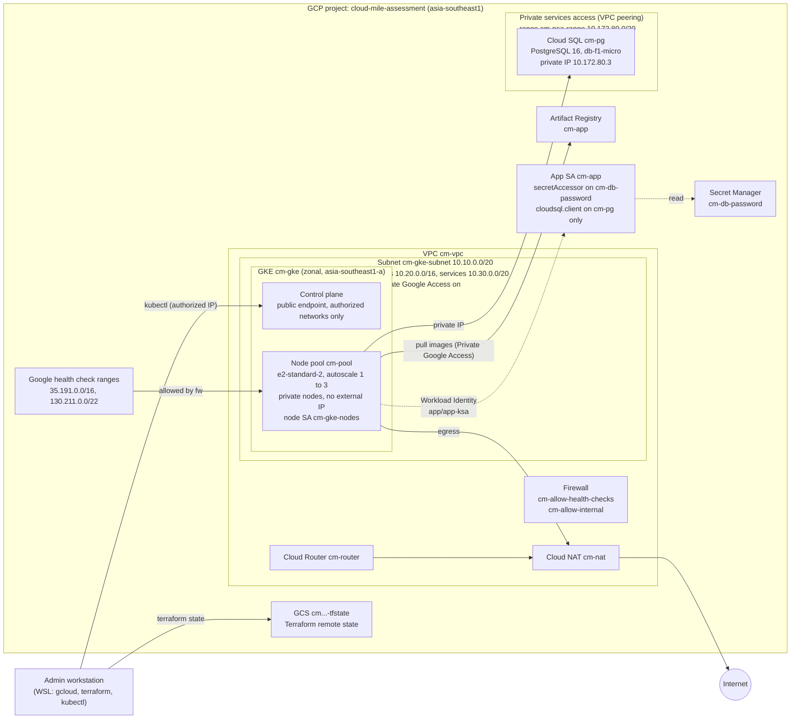
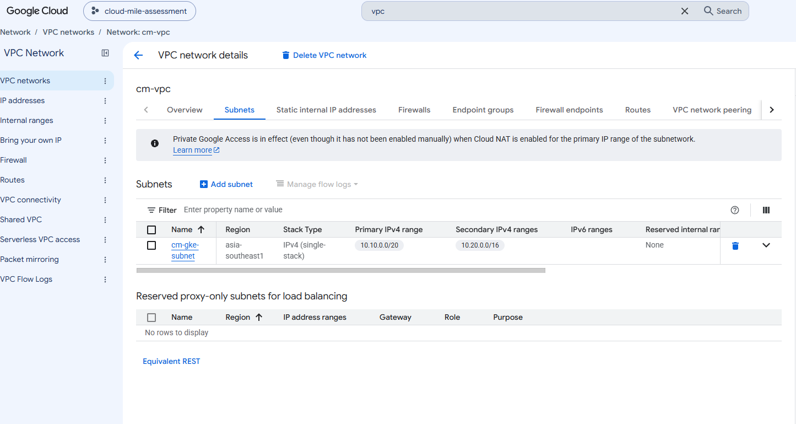
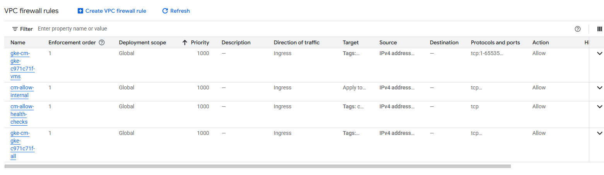
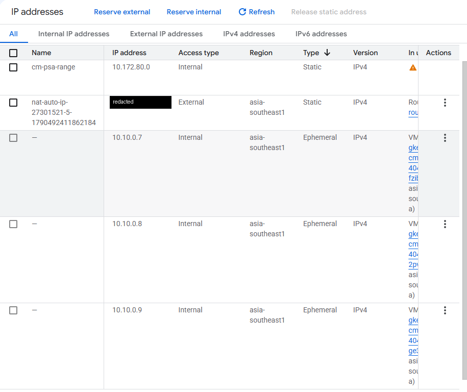
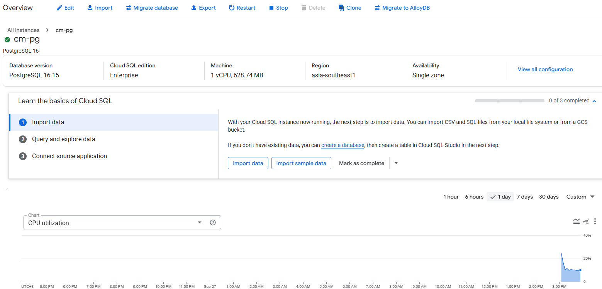
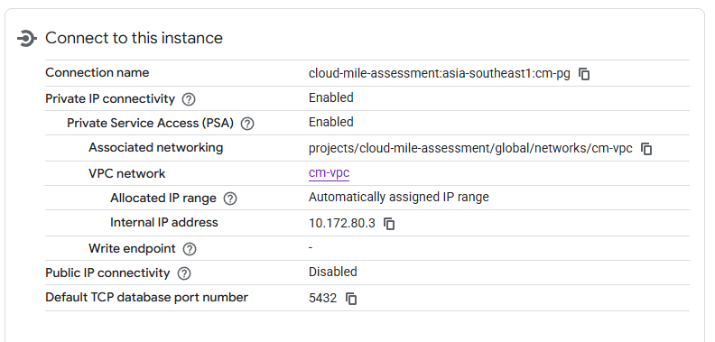
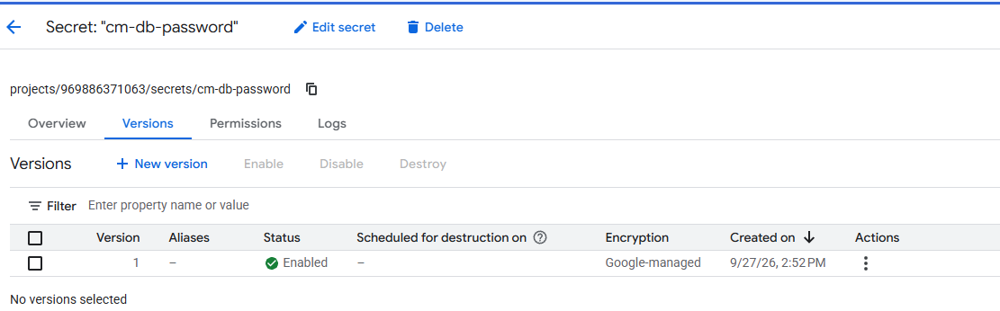
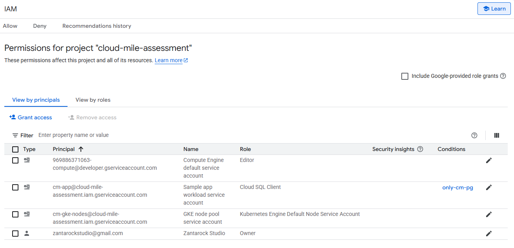
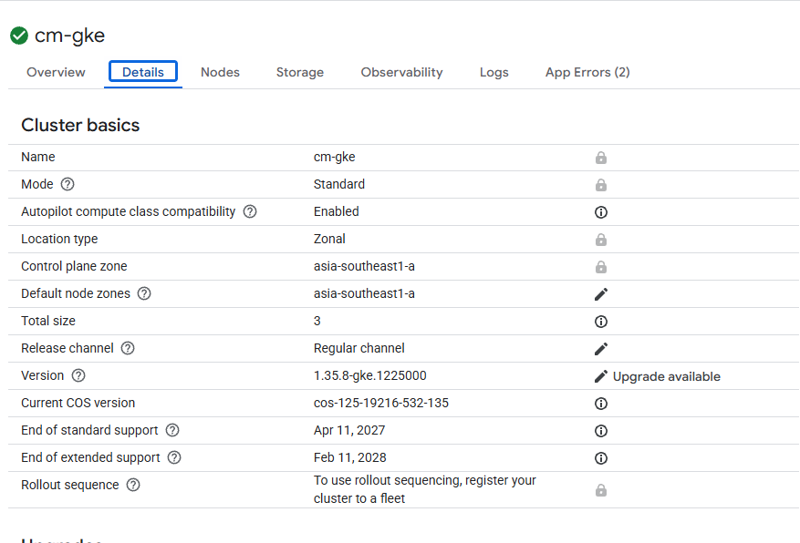
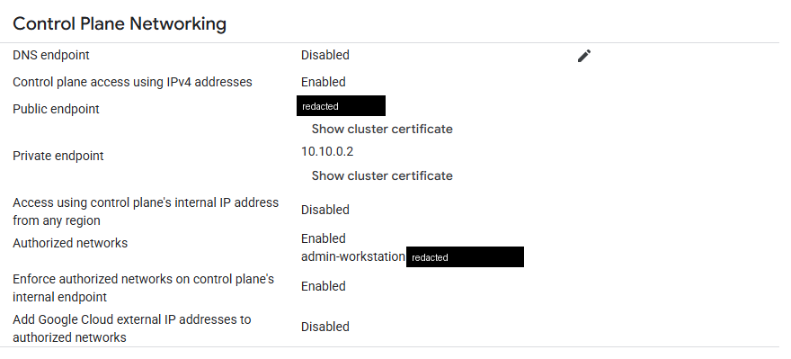

# 01. Task 1: Infrastructure as Code with Terraform

This document records how the Task 1 platform was designed, built with Terraform, verified, and resized. Each step lists the commands run, the result, and where the raw output is stored.

Prerequisites (tools, credentials, APIs, state bucket) are covered in [00-prerequisites.md](00-prerequisites.md).

## Summary

| Brief requirement | Implemented as | Evidence |
|-------------------|----------------|----------|
| VPC and subnet | `cm-vpc` (custom mode) and `cm-gke-subnet` with pod and service secondary ranges | [14-vpc-subnet-describe.txt](../evidence/task-1/platform/14-vpc-subnet-describe.txt) |
| Cloud Router and Cloud NAT | `cm-router`, `cm-nat` | [15-router-nat-describe.txt](../evidence/task-1/platform/15-router-nat-describe.txt) |
| Firewall rules for health checks and internal traffic | `cm-allow-health-checks`, `cm-allow-internal` | [16-firewall.txt](../evidence/task-1/platform/16-firewall.txt) |
| Private GKE cluster with Workload Identity, autoscaling, node service account | `cm-gke` (private nodes), node pool `cm-pool` (1 to 3 nodes), node SA `cm-gke-nodes` | [10-gke-cluster-describe.txt](../evidence/task-1/platform/10-gke-cluster-describe.txt), [11-gke-nodepool-describe.txt](../evidence/task-1/platform/11-gke-nodepool-describe.txt) |
| Cloud SQL for PostgreSQL with private IP | `cm-pg`, PostgreSQL 16, private IP `10.172.80.3`, public IP disabled | [12-sql-instance-describe.txt](../evidence/task-1/platform/12-sql-instance-describe.txt), [17-private-services-access.txt](../evidence/task-1/platform/17-private-services-access.txt) |
| Secret Manager secret for DB credentials | `cm-db-password` | [19-secret-manager.txt](../evidence/task-1/platform/19-secret-manager.txt) |
| Least privilege service account for the application | `cm-app`, bound to Kubernetes SA `app/app-ksa` via Workload Identity | [18-service-accounts-iam.txt](../evidence/task-1/platform/18-service-accounts-iam.txt) |
| Remote state in a GCS bucket | `gs://cloud-mile-assessment-tfstate`, prefix `platform` | [backend.tf](../terraform/platform/backend.tf) |
| Variables, outputs, clear module structure | Root config plus 6 modules | [terraform/platform/](../terraform/platform/) |
| init, plan, apply, output -json, state list | Captured raw | [evidence/task-1/platform/](../evidence/task-1/platform/) |

Additional resource not listed in the brief: an Artifact Registry repository `cm-app` for the Task 2 application image, so that all infrastructure stays in Terraform.

## Architecture



## Code layout

```
terraform/
  bootstrap/                 APIs and state bucket (see 00-prerequisites.md)
  platform/
    backend.tf               GCS backend, prefix "platform"
    versions.tf              Terraform and provider versions
    variables.tf             All inputs with defaults
    terraform.tfvars         Project, region, zone, name prefix
    admin.auto.tfvars        Admin IP for authorized networks (gitignored)
    admin.auto.tfvars.example
    main.tf                  Wires the modules together
    outputs.tf               Values used in Task 2 and later
    modules/
      network/               VPC, subnet, router, NAT, firewall, private services access
      gke/                   Cluster, node pool, node service account
      cloudsql/              Instance, database, user, generated password
      secrets/               Secret Manager secret and version
      iam/                   App service account, IAM bindings, Workload Identity
      registry/              Artifact Registry repository and reader binding
```

Module dependency order: `network` then `gke` and `cloudsql` then `secrets` then `iam` and `registry`. The `iam` module takes the cluster's workload pool as an input, so the Workload Identity binding is only created after the pool exists.

## Design decisions

### Network

| Item | Value | Reason |
|------|-------|--------|
| VPC mode | Custom (`auto_create_subnetworks = false`) | Only the subnets we define, no default ranges in every region |
| Node range | `10.10.0.0/20` | 4,096 addresses, far more than 3 nodes need |
| Pod range | `10.20.0.0/16` | VPC native pods, room for many pods per node |
| Service range | `10.30.0.0/20` | ClusterIP services |
| Private services access range | `/20`, allocated as `10.172.80.0/20` | Reserved for Cloud SQL private IP through VPC peering |
| Private Google Access | Enabled | Private nodes reach Google APIs (Artifact Registry, Logging, Monitoring) without NAT |
| Cloud NAT | Auto allocated IP, all subnet ranges, error logging | Private nodes can reach the internet (for example public images) with no external IPs |

### Firewall

| Rule | Source | Target | Allow | Purpose |
|------|--------|--------|-------|---------|
| `cm-allow-health-checks` | `35.191.0.0/16`, `130.211.0.0/22` | Nodes tagged `cm-gke-node` | TCP | Google load balancer health checks reach nodes and pods (Task 2 Ingress) |
| `cm-allow-internal` | Node, pod and service ranges | All in VPC | TCP, UDP, ICMP | Node to node and pod to pod traffic |

GKE also creates its own rules (`gke-cm-gke-...-all`, `gke-cm-gke-...-vms`). These are managed by GKE and are visible in the firewall screenshot.

### GKE cluster

| Setting | Value | Reason |
|---------|-------|--------|
| Location | Zonal, `asia-southeast1-a` | One zonal cluster's management fee is covered by the GKE free tier |
| Private nodes | Enabled | Nodes have no external IP |
| Control plane endpoint | Public, restricted by authorized networks to the admin IP only | kubectl works from the workstation without a bastion, while the endpoint is closed to everyone else |
| Workload Identity | `cloud-mile-assessment.svc.id.goog` | Pods get Google credentials through their Kubernetes SA, no key files |
| Node metadata | `GKE_METADATA` | Pods cannot read the node SA credentials from the metadata server |
| Release channel | Regular | Automatic, tested upgrades |
| Dataplane | V2 (`ADVANCED_DATAPATH`) | Built in network policy support |
| Secret Manager add-on | Enabled | Task 2 mounts the DB secret through the CSI driver |
| Monitoring | System components, plus kube-state metrics for Pod, Deployment, HPA; Managed Prometheus | Task 3 alerts on pod restarts and HPA state |
| Default node pool | Removed after creation | Node pool is managed as its own resource |
| Deletion protection | On | Prevents accidental destroy before the live defense |

### Node pool

| Setting | Value | Reason |
|---------|-------|--------|
| Machine type | `e2-standard-2` (changed from `e2-medium`, see step 6) | Enough allocatable CPU for GKE system pods plus the app |
| Autoscaling | 1 to 3 nodes | Free trial `E2_CPUS` quota is 8: 3 nodes x 2 vCPU plus 1 surge node = 8 |
| Upgrade | Surge 1, unavailable 0 | A new node is added before an old one is removed |
| Disk | `pd-balanced`, 50 GB | Stays under the 250 GB SSD quota with 4 nodes during a surge |
| Image | Container-Optimized OS with containerd | Default hardened node image |
| Shielded nodes | Secure boot and integrity monitoring on | Node boot integrity |
| Auto repair, auto upgrade | On | Managed node health |

### Service accounts and IAM

| Service account | Roles | Scope | Why this is least privilege |
|-----------------|-------|-------|------------------------------|
| `cm-gke-nodes` (node pool) | `roles/container.defaultNodeServiceAccount` | Project | Google's minimal node role (log write, metric write, metadata). Replaces the default compute SA, which has Editor. |
| `cm-gke-nodes` (node pool) | `roles/artifactregistry.reader` | Repository `cm-app` only | Nodes can pull only from the app repository, not every repository in the project |
| `cm-app` (application) | `roles/secretmanager.secretAccessor` | Secret `cm-db-password` only | Can read one secret, nothing else in Secret Manager |
| `cm-app` (application) | `roles/cloudsql.client` | Project, with IAM condition limiting it to instance `cm-pg` | The Cloud SQL Auth Proxy can connect to this one instance only |
| `cm-app` (application) | `roles/iam.workloadIdentityUser` for `serviceAccount:cloud-mile-assessment.svc.id.goog[app/app-ksa]` | Service account `cm-app` | Only the Kubernetes SA `app-ksa` in namespace `app` can act as `cm-app` |

### Cloud SQL

| Setting | Value | Reason |
|---------|-------|--------|
| Version and edition | PostgreSQL 16, Enterprise | PostgreSQL 16 defaults to Enterprise Plus, which does not offer shared core tiers |
| Tier | `db-f1-micro` | Lowest cost. Its low `max_connections` also makes the Task 3 "connections above 80%" alert easy to trigger |
| Availability | Zonal, same zone as GKE | Cost; HA is not required for this assessment |
| Network | Private IP only (`ipv4_enabled = false`), `ssl_mode = ENCRYPTED_ONLY` | No public exposure, encrypted connections only |
| Backups | Daily at 18:00 UTC (02:00 MYT), 7 retained | Recovery point for the break/fix exercise |
| Maintenance | Saturday 19:00 UTC (Sunday 03:00 MYT) | Low traffic window |
| Query Insights | On | Query level diagnostics for troubleshooting |
| Deletion protection | On (Terraform and GCP side) | Prevents accidental deletion |

### Secrets

The DB password is generated by `random_password` (24 characters) and written to both the Cloud SQL user and a Secret Manager secret version. The secret is replicated only in `asia-southeast1`.

Trade-off: any value a Terraform resource uses is stored in state, so the password is present in the state file. This is mitigated by the state bucket having public access prevention enforced, uniform bucket level access, and versioning. The value never appears in plan, apply, or output evidence (shown as `(sensitive value)`). A further step would be Terraform write-only arguments, which keep the value out of state entirely.

## Steps performed

### Step 1: Set the admin IP for authorized networks

The workstation's public IP was placed in `admin.auto.tfvars`, which is gitignored because the repository will be public. An example file shows the format.

```bash
curl -s -4 https://ifconfig.me
cp admin.auto.tfvars.example admin.auto.tfvars   # then edit cidr_block
```

### Step 2: Format, initialise, validate

```bash
cd terraform/platform
terraform fmt -recursive
terraform init
terraform validate
```

Result: `Success! The configuration is valid.` The backend initialised against `gs://cloud-mile-assessment-tfstate` with prefix `platform`.

Raw output: [01-init.txt](../evidence/task-1/platform/01-init.txt)

### Step 3: Plan

```bash
terraform plan -out=platform.tfplan
```

Result: `Plan: 24 to add, 0 to change, 0 to destroy.`

Raw output: [02-plan.txt](../evidence/task-1/platform/02-plan.txt)

### Step 4: Apply

```bash
terraform apply platform.tfplan
```

Result: `Apply complete! Resources: 24 added, 0 changed, 0 destroyed.`

Notable durations from the apply log:

| Resource | Time |
|----------|------|
| Private services access peering | 55s |
| GKE cluster | 7m51s |
| Node pool | 1m22s |
| Cloud SQL instance | 12m6s |

Raw output: [03-apply.txt](../evidence/task-1/platform/03-apply.txt)

### Step 5: Capture outputs, state, and verify cluster access

```bash
terraform output -json
terraform state list
gcloud container clusters get-credentials cm-gke --zone asia-southeast1-a --project cloud-mile-assessment
kubectl get nodes -o wide
kubectl get pods -A
```

Result: 24 resources in state. kubectl reached the control plane through the authorized network. All nodes reported `Ready` with an internal IP only and no external IP, confirming private nodes.

Key outputs:

| Output | Value |
|--------|-------|
| `gke_cluster_name` | `cm-gke` |
| `gke_node_service_account` | `cm-gke-nodes@cloud-mile-assessment.iam.gserviceaccount.com` |
| `sql_connection_name` | `cloud-mile-assessment:asia-southeast1:cm-pg` |
| `sql_private_ip` | `10.172.80.3` |
| `db_name` / `db_user` | `appdb` / `app` |
| `db_password_secret` | `cm-db-password` |
| `app_service_account` | `cm-app@cloud-mile-assessment.iam.gserviceaccount.com` |
| `app_ksa` | `app/app-ksa` |
| `artifact_registry_url` | `asia-southeast1-docker.pkg.dev/cloud-mile-assessment/cm-app` |

Raw output: [04-output.json](../evidence/task-1/platform/04-output.json), [05-state-list.txt](../evidence/task-1/platform/05-state-list.txt), [21-kubectl-access.txt](../evidence/task-1/platform/21-kubectl-access.txt)

### Step 6: Capacity finding and node pool resize

With `e2-medium` nodes, the cluster autoscaler scaled straight to its maximum of 3 nodes before any application was deployed, and one Managed Prometheus collector pod stayed `Pending`.

```bash
kubectl get pods -A --field-selector=status.phase!=Running
kubectl get node -o custom-columns=NAME:.metadata.name,CPU:.status.allocatable.cpu,MEM:.status.allocatable.memory
kubectl describe nodes | grep -A5 "Allocated resources"
```

Findings on `e2-medium`:

| Node | Allocatable CPU | CPU requested by system pods | Memory requested |
|------|-----------------|------------------------------|------------------|
| 9dgt | 940m | 775m (82%) | 53% |
| b08t | 940m | 940m (100%) | 49% |
| ptcw | 940m | 894m (95%) | 48% |

Root cause: `e2-medium` exposes only 940m allocatable CPU. GKE system components (logging, metrics agent, Dataplane V2, Secret Manager CSI driver, Managed Prometheus collectors) request most of it, leaving no room for the application or for HPA scale out in Task 2.

Fix: change `node_machine_type` to `e2-standard-2`. It uses the same 2 vCPU of `E2_CPUS` quota per node, but has about 1.9 CPU and 6 GB allocatable.

```bash
terraform plan -out=platform.tfplan
terraform apply platform.tfplan
```

The first plan also showed an in-place change on the cluster's `monitoring_config.enable_components`. This was a list order difference only: the GKE API returns the components as `SYSTEM_COMPONENTS, HPA, POD, DEPLOYMENT`. The order in code was changed to match so the plan stays clean. The final plan was a single in-place update:

```
~ machine_type = "e2-medium" -> "e2-standard-2"
Plan: 0 to add, 1 to change, 0 to destroy.
```

GKE rolled the nodes one at a time using the surge setting (13m56s). Result: `Apply complete! Resources: 0 added, 1 changed, 0 destroyed.`

After the resize:

| Node | CPU requested | Memory requested |
|------|---------------|------------------|
| 2pvm | 915m (47%) | 22% |
| fzib | 805m (41%) | 25% |
| ge3c | 894m (46%) | 22% |

No pods were left in `Pending`.

Raw output: [06-plan-machine-type.txt](../evidence/task-1/platform/06-plan-machine-type.txt), [07-apply-machine-type.txt](../evidence/task-1/platform/07-apply-machine-type.txt), [21-kubectl-access.txt](../evidence/task-1/platform/21-kubectl-access.txt)

### Step 7: Confirm no drift

```bash
terraform plan -detailed-exitcode
```

Result: `found no differences, so no changes are needed`, exit code 0.

Raw output: [08-plan-no-drift.txt](../evidence/task-1/platform/08-plan-no-drift.txt)

### Step 8: Verify every resource independently with gcloud

```bash
P=cloud-mile-assessment; Z=asia-southeast1-a; R=asia-southeast1

gcloud container clusters describe cm-gke --zone $Z --project $P
gcloud container node-pools describe cm-pool --cluster cm-gke --zone $Z --project $P
gcloud sql instances describe cm-pg --project $P
gcloud sql databases list --instance cm-pg --project $P
gcloud sql users list --instance cm-pg --project $P
gcloud compute networks describe cm-vpc --project $P
gcloud compute networks subnets describe cm-gke-subnet --region $R --project $P
gcloud compute routers describe cm-router --region $R --project $P
gcloud compute routers nats describe cm-nat --router cm-router --region $R --project $P
gcloud compute firewall-rules list --filter="network:cm-vpc" --project $P
gcloud compute addresses describe cm-psa-range --global --project $P
gcloud services vpc-peerings list --network cm-vpc --project $P
gcloud iam service-accounts list --project $P
gcloud iam service-accounts get-iam-policy cm-app@$P.iam.gserviceaccount.com
gcloud projects get-iam-policy $P --flatten=bindings[].members \
  --filter="bindings.members:(cm-gke-nodes OR cm-app)"
gcloud secrets describe cm-db-password --project $P
gcloud secrets versions list cm-db-password --project $P
gcloud secrets get-iam-policy cm-db-password --project $P
gcloud artifacts repositories describe cm-app --location $R --project $P
gcloud artifacts repositories get-iam-policy cm-app --location $R --project $P
```

| Check | Result |
|-------|--------|
| Cluster private nodes | `enablePrivateNodes: true` |
| Authorized networks | Enabled, single admin `/32` |
| Workload Identity | `workloadPool: cloud-mile-assessment.svc.id.goog` |
| Node pool | `e2-standard-2`, autoscaling 1 to 3, `GKE_METADATA`, SA `cm-gke-nodes` |
| Cloud SQL | `ipv4Enabled: false`, private IP `10.172.80.3`, `ENCRYPTED_ONLY` |
| Subnet | `privateIpGoogleAccess: true`, secondary ranges `pods`, `services` |
| NAT | `AUTO_ONLY`, all subnet ranges, error logging |
| Secret | 1 version enabled, accessor binding only for `cm-app` |
| Artifact Registry | Reader binding only for `cm-gke-nodes` |

Raw output: files `10` to `20` in [evidence/task-1/platform/](../evidence/task-1/platform/)

## Console screenshots

**VPC and subnet**



**Firewall rules** (the two `cm-` rules are from Terraform, the two `gke-` rules are created by GKE)



**IP addresses** (private services access range, NAT egress IP, node internal IPs only)



**Cloud SQL overview**



**Cloud SQL connectivity** (private IP enabled through private services access, public IP disabled)



**Secret Manager**



**IAM** (`cm-app` has Cloud SQL Client with the `only-cm-pg` condition)



**GKE cluster details**



**GKE control plane networking** (public endpoint restricted to the authorized admin network)



## Security notes and redactions

- The repository will be public. The following were redacted in evidence and screenshots: billing account ID, admin workstation IP, control plane public IP, and the NAT egress IP.
- The admin IP lives only in the gitignored `admin.auto.tfvars`. If the workstation IP changes, kubectl access stops until the file is updated and applied.
- The DB password is in Terraform state (see Secrets above) and nowhere in the repository or evidence.
- The Compute Engine default service account still holds the project Editor role (visible in the IAM screenshot). It is created by GCP when the Compute API is enabled and is not used by any resource here, since the node pool uses `cm-gke-nodes`.

## Cleanup (not run)

Do not run before the live defense. Deletion protection must be turned off with an apply first, then destroy:

```bash
cd terraform/platform
terraform apply   -var=deletion_protection=false
terraform destroy -var=deletion_protection=false
```

The full cleanup plan and notes are covered in Task 6.

## Evidence index

| File | Content |
|------|---------|
| [01-init.txt](../evidence/task-1/platform/01-init.txt) | `terraform init` |
| [02-plan.txt](../evidence/task-1/platform/02-plan.txt) | Initial plan, 24 to add |
| [03-apply.txt](../evidence/task-1/platform/03-apply.txt) | Initial apply |
| [04-output.json](../evidence/task-1/platform/04-output.json) | `terraform output -json` |
| [05-state-list.txt](../evidence/task-1/platform/05-state-list.txt) | `terraform state list` |
| [06-plan-machine-type.txt](../evidence/task-1/platform/06-plan-machine-type.txt) | Plan for node pool resize |
| [07-apply-machine-type.txt](../evidence/task-1/platform/07-apply-machine-type.txt) | Apply for node pool resize |
| [08-plan-no-drift.txt](../evidence/task-1/platform/08-plan-no-drift.txt) | Final plan, no changes |
| [10-gke-cluster-describe.txt](../evidence/task-1/platform/10-gke-cluster-describe.txt) | GKE cluster |
| [11-gke-nodepool-describe.txt](../evidence/task-1/platform/11-gke-nodepool-describe.txt) | Node pool |
| [12-sql-instance-describe.txt](../evidence/task-1/platform/12-sql-instance-describe.txt) | Cloud SQL instance |
| [13-sql-db-users.txt](../evidence/task-1/platform/13-sql-db-users.txt) | Databases and users |
| [14-vpc-subnet-describe.txt](../evidence/task-1/platform/14-vpc-subnet-describe.txt) | VPC and subnet |
| [15-router-nat-describe.txt](../evidence/task-1/platform/15-router-nat-describe.txt) | Cloud Router and NAT |
| [16-firewall.txt](../evidence/task-1/platform/16-firewall.txt) | Firewall rules |
| [17-private-services-access.txt](../evidence/task-1/platform/17-private-services-access.txt) | PSA range and peering |
| [18-service-accounts-iam.txt](../evidence/task-1/platform/18-service-accounts-iam.txt) | Service accounts and IAM bindings |
| [19-secret-manager.txt](../evidence/task-1/platform/19-secret-manager.txt) | Secret, versions, IAM |
| [20-artifact-registry.txt](../evidence/task-1/platform/20-artifact-registry.txt) | Repository and IAM |
| [21-kubectl-access.txt](../evidence/task-1/platform/21-kubectl-access.txt) | kubectl nodes, pods, allocated resources |
