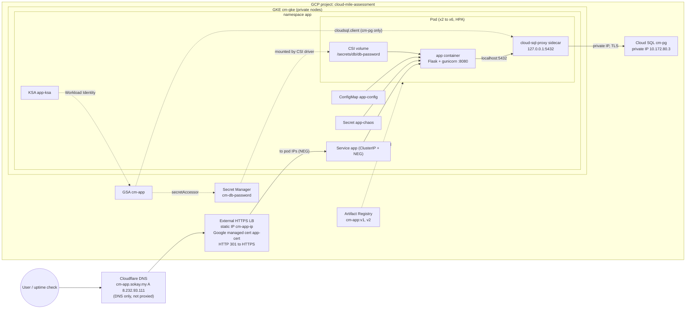
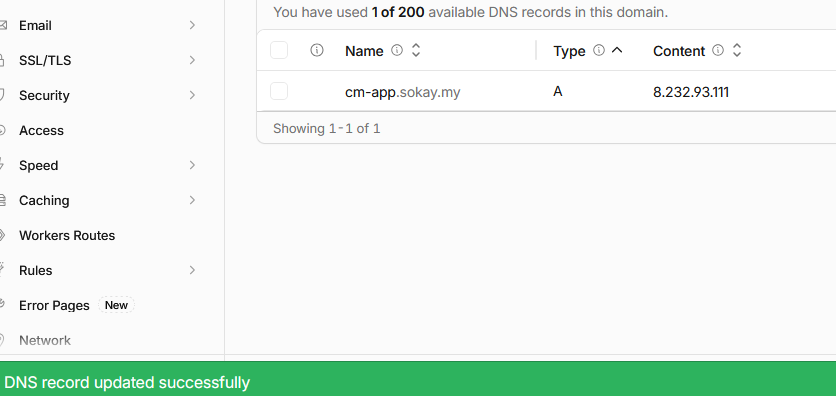
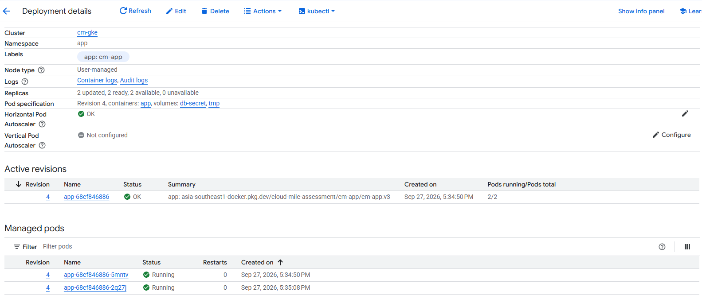
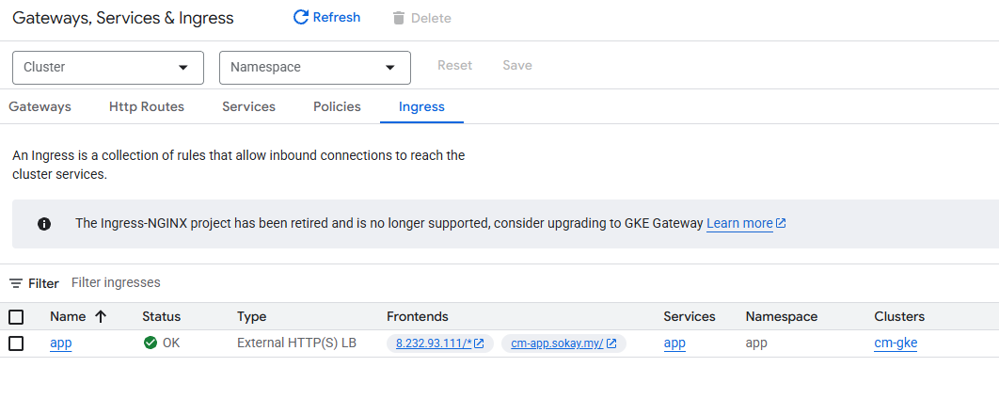
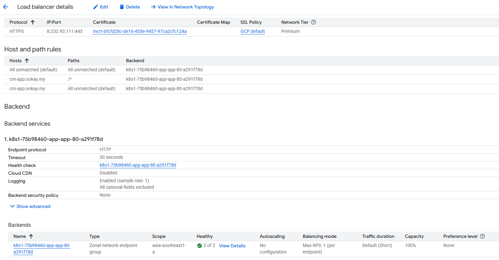
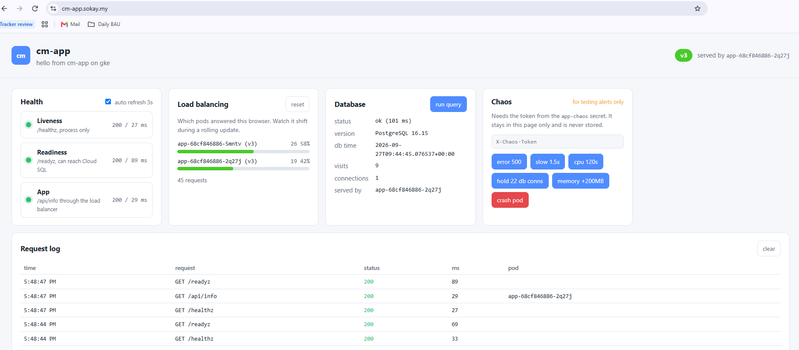
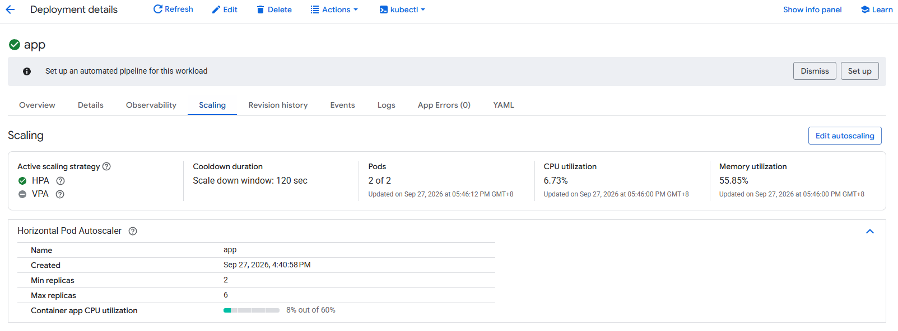

# 02. Task 2: GKE Deployment and Operations

This document records how the sample application was built, deployed to the Task 1 GKE cluster, connected to Cloud SQL, exposed over HTTPS, and operated (rolling update, rollback, scale up and down, HPA). Each step lists the commands run, the result, and where the raw output is stored.

## Summary

| Brief requirement | Implemented as | Evidence |
|-------------------|----------------|----------|
| Deployment | `app` in namespace `app`, app container plus Cloud SQL Auth Proxy native sidecar | [05-deployment.yaml](../k8s/05-deployment.yaml), [06-kubectl-describe-pod.txt](../evidence/task-2/06-kubectl-describe-pod.txt) |
| Service | `app`, ClusterIP with container native load balancing (NEG) | [06-service.yaml](../k8s/06-service.yaml) |
| Ingress | `app`, external HTTPS load balancer on static IP `cm-app-ip`, host `cm-app.sokay.my` | [10-ingress.yaml](../k8s/10-ingress.yaml) |
| ConfigMap | `app-config` | [02-configmap.yaml](../k8s/02-configmap.yaml) |
| Secret | `app-chaos` (Kubernetes Secret, created by script) and DB password from Secret Manager via CSI | [03-secret.yaml.example](../k8s/03-secret.yaml.example), [04-secretproviderclass.yaml](../k8s/04-secretproviderclass.yaml) |
| HPA | 2 to 6 pods on app container CPU, target 60% | [11-hpa.yaml](../k8s/11-hpa.yaml), [12-scale-hpa.txt](../evidence/task-2/12-scale-hpa.txt) |
| PDB | `minAvailable: 1` | [12-pdb.yaml](../k8s/12-pdb.yaml) |
| Readiness and liveness probes | App: `/readyz` (checks DB), `/healthz` (process only). Proxy: `/startup`, `/liveness` | [05-deployment.yaml](../k8s/05-deployment.yaml) |
| Resource requests and limits | Set on both containers | [05-deployment.yaml](../k8s/05-deployment.yaml) |
| Cloud SQL connection | Cloud SQL Auth Proxy v2.25.4 sidecar, private IP, Workload Identity | [08-cloudsql-connectivity.txt](../evidence/task-2/08-cloudsql-connectivity.txt) |
| Rolling update | v1 to v2 | [09-rolling-update.txt](../evidence/task-2/09-rolling-update.txt) |
| Rollback | v2 back to v1 with `rollout undo` | [10-rollback.txt](../evidence/task-2/10-rollback.txt) |
| Scale up and down | Manual through HPA `minReplicas`, automatic through CPU load | [11-scale-manual.txt](../evidence/task-2/11-scale-manual.txt), [12-scale-hpa.txt](../evidence/task-2/12-scale-hpa.txt) |
| `kubectl get pods -A -o wide`, `describe pod`, `logs` | Captured raw | [05-kubectl-get.txt](../evidence/task-2/05-kubectl-get.txt), [06-kubectl-describe-pod.txt](../evidence/task-2/06-kubectl-describe-pod.txt), [07-kubectl-logs.txt](../evidence/task-2/07-kubectl-logs.txt) |

## Architecture (updated)



## Application

A small Python (Flask on gunicorn) app in [app/main.py](../app/main.py). It is built to create every signal needed for Task 3 (monitoring) and Task 4 (break and fix).

| Endpoint | Purpose | Used in |
|----------|---------|---------|
| `GET /` | Browsers get the web page (v3 and later); curl and scripts get JSON with version, pod name, message | App response, rolling update and rollback proof |
| `GET /api/info` | Always JSON: version, pod, message | Polled by the web page |
| `GET /healthz` | Liveness. Process only, never touches the DB | Liveness probe, LB health check |
| `GET /readyz` | Readiness. Runs `SELECT 1` on Cloud SQL with a 2s timeout | Readiness probe |
| `GET /db` | Inserts a row into `visits`, returns DB time, version, visit count, connection count | Cloud SQL connectivity proof, Task 5 script |
| `GET /error` | Returns 500 and logs `severity=ERROR` | Task 3 error rate and log based metric |
| `GET /slow?ms=` | Delays the response | Task 3 latency |
| `GET /cpu?seconds=` | Burns CPU in a separate process | HPA scale out, Task 3 node CPU alert |
| `GET /memory?mb=` | Allocates and holds memory | OOMKilled scenario |
| `GET /connections?n=&seconds=` | Holds N DB connections open | Task 3 Cloud SQL connections alert |
| `GET /crash` | Stops the gunicorn master so the container restarts | Task 3 pod restart alert |

Design points:
- **Chaos endpoints are locked.** They only work when `CHAOS_ENABLED=true` in the ConfigMap and the request carries an `X-Chaos-Token` header matching the `app-chaos` Kubernetes Secret. Without the token they return 403, so nobody on the internet can crash the app through the public URL.
- **`CRASH_ON_START`** in the ConfigMap makes the app exit at startup, which gives a sustained CrashLoopBackOff on demand.
- **Structured logs.** Every line is JSON on stdout with a `severity` field, which Cloud Logging maps to log severity automatically. Access logs include `path`, `status`, and `latency_ms`. Probe requests are not logged to keep noise down.
- **Password read per connection** from the CSI mounted file, so a rotated or broken secret takes effect immediately.
- **Liveness does not depend on the DB.** If Cloud SQL has a problem, pods go unready (removed from the LB) but are not restarted in a loop.

Web page (from v3): [templates/index.html](../app/templates/index.html), [static/app.css](../app/static/app.css), [static/app.js](../app/static/app.js). It shows live health checks, which pods and versions answered (useful to watch a rolling update), a DB query panel, a chaos panel (token kept in page memory only), and a request log. CSS and JS are separate files so the page runs under a strict `Content-Security-Policy: default-src 'self'`.

Image: `python:3.12-slim`, runs as non root UID 10001, read only root filesystem in the pod, `/tmp` on an `emptyDir`.

## Kubernetes manifests

| File | Kind | Key settings |
|------|------|--------------|
| [00-namespace.yaml](../k8s/00-namespace.yaml) | Namespace | `app` |
| [01-serviceaccount.yaml](../k8s/01-serviceaccount.yaml) | ServiceAccount | `app-ksa`, annotated with GSA `cm-app` for Workload Identity |
| [02-configmap.yaml](../k8s/02-configmap.yaml) | ConfigMap | DB host/port/name/user, password file path, message, chaos flags |
| [03-secret.yaml.example](../k8s/03-secret.yaml.example) | Secret | Template only. Named `.example` so `kubectl apply -f k8s/` never overwrites the real token |
| [04-secretproviderclass.yaml](../k8s/04-secretproviderclass.yaml) | SecretProviderClass | `provider: gke`, mounts `cm-db-password` (latest) as `db-password` |
| [05-deployment.yaml](../k8s/05-deployment.yaml) | Deployment | See below |
| [06-service.yaml](../k8s/06-service.yaml) | Service | ClusterIP, NEG annotation, BackendConfig reference |
| [07-backendconfig.yaml](../k8s/07-backendconfig.yaml) | BackendConfig | LB health check `/healthz`, 30s connection draining, LB request logging on |
| [08-frontendconfig.yaml](../k8s/08-frontendconfig.yaml) | FrontendConfig | HTTP to HTTPS redirect (301) |
| [09-managedcertificate.yaml](../k8s/09-managedcertificate.yaml) | ManagedCertificate | `cm-app.sokay.my` |
| [10-ingress.yaml](../k8s/10-ingress.yaml) | Ingress | GCE class, static IP `cm-app-ip`, managed cert, FrontendConfig |
| [11-hpa.yaml](../k8s/11-hpa.yaml) | HorizontalPodAutoscaler | 2 to 6, `ContainerResource` CPU of the `app` container at 60%, scale down window 120s |
| [12-pdb.yaml](../k8s/12-pdb.yaml) | PodDisruptionBudget | `minAvailable: 1` |

### Deployment details

| Setting | Value | Reason |
|---------|-------|--------|
| Replicas | Not set in the manifest | The HPA owns the replica count; setting it would fight the HPA on every apply |
| Strategy | RollingUpdate, `maxSurge: 1`, `maxUnavailable: 0` | New pod is ready before an old one is removed, no capacity drop |
| Topology spread | `maxSkew: 1` across nodes, `ScheduleAnyway` | Pods spread over nodes so one node failure does not take out all replicas |
| Pod security | `runAsNonRoot`, seccomp `RuntimeDefault`, no privilege escalation, all capabilities dropped, read only root filesystem | Hardened defaults |
| Cloud SQL proxy | Native sidecar (`initContainers` with `restartPolicy: Always`) | Starts and passes its startup probe before the app starts, stops after the app on shutdown |
| Proxy flags | `--private-ip`, `--port=5432`, `--structured-logs`, `--health-check`, `--exit-zero-on-sigterm` | Private path to Cloud SQL, JSON logs, health endpoints for probes |

### Probes

| Container | Probe | Path | Settings | Why |
|-----------|-------|------|----------|-----|
| cloud-sql-proxy | Startup | `/startup` :9090 | every 1s, up to 30 failures | App does not start until the proxy is connected |
| cloud-sql-proxy | Liveness | `/liveness` :9090 | every 10s, 3 failures | Restart a stuck proxy |
| app | Readiness | `/readyz` | every 10s, timeout 3s, 3 failures | Only send traffic to pods that can reach the DB |
| app | Liveness | `/healthz` | after 10s, every 10s, timeout 3s, 3 failures | Restart only if the process itself hangs |

### Resources

| Container | Requests | Limits |
|-----------|----------|--------|
| app | 100m CPU, 128Mi | 500m CPU, 256Mi |
| cloud-sql-proxy | 50m CPU, 64Mi | 200m CPU, 128Mi |

At 6 pods the requests total 900m CPU, which fits the free capacity left on the `e2-standard-2` nodes after the Task 1 resize.

## Steps performed

### Step 1: Reserve a static IP for the Ingress (Terraform)

A global static IP was added to the Task 1 Terraform as a new `ingress` module, so the IP survives Ingress recreation and DNS can point at it.

```bash
cd terraform/platform
terraform plan -out=platform.tfplan    # Plan: 1 to add
terraform apply platform.tfplan
terraform output -raw app_ip_address   # 8.232.93.111
```

Raw output: [01-tf-plan-static-ip.txt](../evidence/task-2/01-tf-plan-static-ip.txt), [02-tf-apply-static-ip.txt](../evidence/task-2/02-tf-apply-static-ip.txt)

### Step 2: DNS record

An A record `cm-app.sokay.my -> 8.232.93.111` was created in Cloudflare with proxy off (DNS only). A Google managed certificate cannot be issued while Cloudflare proxies the traffic, because Google must see its own load balancer answer for the domain.



Verified through public resolvers:

```bash
curl -s -H "accept: application/dns-json" "https://cloudflare-dns.com/dns-query?name=cm-app.sokay.my&type=A"
curl -s "https://dns.google/resolve?name=cm-app.sokay.my&type=A"
```

Both returned `8.232.93.111`.

### Step 3: Build and push the image

```bash
cd app
docker build --build-arg APP_VERSION=v1 -t cm-app:v1 .
docker run -d --rm -p 18080:8080 -e CHAOS_ENABLED=true -e CHAOS_TOKEN=t cm-app:v1   # local smoke test

gcloud auth configure-docker asia-southeast1-docker.pkg.dev --quiet
REPO=asia-southeast1-docker.pkg.dev/cloud-mile-assessment/cm-app
for v in v1 v2; do
  docker build --build-arg APP_VERSION=$v -t $REPO/cm-app:$v .
  docker push $REPO/cm-app:$v
done
```

Local smoke test results: `/` 200, `/healthz` 200, `/readyz` 503 (expected, no DB locally), `/error` 403 without token and 500 with token, JSON logs with `severity`.

v2 is the same code with `APP_VERSION=v2`, used to show the rolling update.

Raw output: [03-image-build-push.txt](../evidence/task-2/03-image-build-push.txt)

### Step 4: Deploy

```bash
kubectl apply -f k8s/00-namespace.yaml
kubectl apply -f k8s/ --dry-run=server        # validate everything against the API server
scripts/create-app-secret.sh                  # random token into Secret app-chaos, never printed or committed
kubectl apply -f k8s/
kubectl -n app rollout status deploy/app
```

Result: all 12 objects created, `deployment "app" successfully rolled out`. The only warning is Kubernetes flagging the `kubernetes.io/ingress.class` annotation as deprecated; GKE's Ingress controller still documents and uses it.

Raw output: [04-kubectl-apply.txt](../evidence/task-2/04-kubectl-apply.txt)

### Step 5: Inspect pods, describe, logs

```bash
kubectl get pods -A -o wide
kubectl -n app get deploy,rs,pods,svc,ingress,hpa,pdb,managedcertificate,secretproviderclass,configmap,secret,sa -o wide
kubectl -n app describe pod <pod>
kubectl -n app logs <pod> -c app
kubectl -n app logs <pod> -c cloud-sql-proxy
```

Result: both containers `Ready: True`, `Restart Count: 0`, `Service Account: app-ksa`. `CHAOS_TOKEN` shows only as `<set to the key 'token' in secret 'app-chaos'>`. One early `Startup probe failed ... connection refused` event on the proxy is expected: the probe runs every second while the proxy is still starting.

Raw output: [05-kubectl-get.txt](../evidence/task-2/05-kubectl-get.txt), [06-kubectl-describe-pod.txt](../evidence/task-2/06-kubectl-describe-pod.txt), [07-kubectl-logs.txt](../evidence/task-2/07-kubectl-logs.txt)

### Step 6: Prove Cloud SQL connectivity

```bash
kubectl -n app exec <pod> -c app -- python -c "...urlopen('http://localhost:8080/db')..."
kubectl -n app exec <pod> -c app -- ls -l /secrets/db/
```

Result (two consecutive calls):

```json
{"db_connections":1,"db_time":"2026-09-27T08:42:05.577001+00:00","db_version":"PostgreSQL 16.15 on x86_64-pc-linux-gnu, ...","pod":"app-cf4575ccb-295l9","visits":1}
{"db_connections":1,"db_time":"2026-09-27T08:42:06.976861+00:00","db_version":"PostgreSQL 16.15 on x86_64-pc-linux-gnu, ...","pod":"app-cf4575ccb-295l9","visits":2}
```

This proves the full path: app to proxy on localhost, proxy to Cloud SQL on private IP using the `cm-app` GSA through Workload Identity, and the password read from Secret Manager through the CSI mount (`/secrets/db/db-password`). The proxy logs show `Accepted connection from 127.0.0.1` for each readiness check.

Raw output: [08-cloudsql-connectivity.txt](../evidence/task-2/08-cloudsql-connectivity.txt), [07-kubectl-logs.txt](../evidence/task-2/07-kubectl-logs.txt)

### Step 7: Rolling update v1 to v2

```bash
kubectl -n app annotate deploy/app kubernetes.io/change-cause="initial deploy v1" --overwrite
kubectl -n app set image deploy/app app=asia-southeast1-docker.pkg.dev/cloud-mile-assessment/cm-app/cm-app:v2
kubectl -n app annotate deploy/app kubernetes.io/change-cause="update to v2" --overwrite
kubectl -n app rollout status deploy/app
kubectl -n app rollout history deploy/app
```

| Time (UTC) | State |
|------------|-------|
| 08:42:40 | All pods return `"version":"v1"` (ReplicaSet `app-cf4575ccb`) |
| 08:42:44 | `set image` to v2 |
| Before 08:43:40 | `successfully rolled out`, all pods return `"version":"v2"` (ReplicaSet `app-76d5cc9c79`) |

History after update: revision 1 `initial deploy v1`, revision 2 `update to v2`.

Raw output: [09-rolling-update.txt](../evidence/task-2/09-rolling-update.txt)

### Step 8: Rollback v2 to v1

```bash
kubectl -n app rollout undo deploy/app
kubectl -n app rollout status deploy/app
kubectl -n app rollout history deploy/app
```

| Time (UTC) | State |
|------------|-------|
| 08:43:40 | `rollout undo` |
| After rollout | All pods return `"version":"v1"`, back on ReplicaSet `app-cf4575ccb` |

History after rollback: revision 2 `update to v2`, revision 3 `initial deploy v1`. The old v1 ReplicaSet was reused (same pod template hash), which is how rollback works in Kubernetes: it re-applies a previous template as a new revision.

Raw output: [10-rollback.txt](../evidence/task-2/10-rollback.txt)

### Step 9: Scale up and down (manual)

With an HPA in place, `kubectl scale deploy/app` is overwritten by the HPA within seconds. Manual scaling is therefore done through the HPA bounds:

```bash
kubectl -n app patch hpa app -p '{"spec":{"minReplicas":4}}'   # scale up
kubectl -n app patch hpa app -p '{"spec":{"minReplicas":2}}'   # scale down
```

| Time (UTC) | Action | Replicas |
|------------|--------|----------|
| 08:45:06 | Start | 3 |
| 08:45:07 | `minReplicas` 2 to 4 | 4 |
| 08:45:38 | `minReplicas` 4 to 2 | 4, held by the 120s scale down stabilization window |
| 08:48:38 | After the window | 2 |

Raw output: [11-scale-manual.txt](../evidence/task-2/11-scale-manual.txt), script: [demo-scaling.sh](../scripts/demo-scaling.sh)

### Step 10: HPA autoscaling behaviour

CPU load was generated on each pod with the token protected `/cpu?seconds=240` endpoint, then the HPA was sampled every 20 seconds.

| Time | HPA CPU (target 60%) | Replicas | Note |
|------|----------------------|----------|------|
| 08:48:39 | 3% | 2 | Load started on both pods |
| t+20s | 33% | 2 | Metrics catching up |
| t+40s | 498% | 6 | Scaled straight to max |
| t+80s | 244% | 6 | Load spread across 6 pods (4 idle) |
| t+120s to t+220s | 169% | 6 | Two pods at the 500m limit, CPU throttled |
| After load ended | 3% | 6, then 5, then 2 | Scale down after the stabilization window |

HPA events confirm: `New size: 6; reason: cpu container resource utilization (percentage of request) above target`, then `New size: 5` and `New size: 2 ... below target`.

All 6 pods scheduled on the existing nodes without the cluster autoscaler adding a node, confirming the Task 1 resize to `e2-standard-2` left enough headroom. After the demo, the cluster autoscaler scaled the node pool back down to 2 nodes.

Utilisation is measured against the `app` container request only (`ContainerResource`), so the proxy sidecar does not skew the calculation.

Raw output: [12-scale-hpa.txt](../evidence/task-2/12-scale-hpa.txt)

### Step 11: HTTPS through the Ingress

After the A record resolved, Google validated the domain and issued the certificate. The Ingress then served HTTPS on the static IP.

```bash
kubectl -n app get managedcertificate app-cert -o yaml
kubectl -n app describe ingress app
curl -sS -o /dev/null -w "%{http_code} -> %{redirect_url}\n" http://cm-app.sokay.my/
curl -sS https://cm-app.sokay.my/
curl -sS https://cm-app.sokay.my/healthz
curl -sS https://cm-app.sokay.my/db
curl -sS https://cm-app.sokay.my/error
echo | openssl s_client -connect cm-app.sokay.my:443 -servername cm-app.sokay.my 2>/dev/null \
  | openssl x509 -noout -subject -issuer -dates -ext subjectAltName
```

| Check | Result |
|-------|--------|
| Domain status on the ManagedCertificate | `cm-app.sokay.my: Active` |
| HTTP | `301 -> https://cm-app.sokay.my:443/` (FrontendConfig redirect) |
| `GET https://cm-app.sokay.my/` | `200`, `{"message":"hello from cm-app on gke","pod":"app-cf4575ccb-hnfvt","version":"v1"}`, TLS verify OK, 0.13s |
| `GET /healthz` | `200`, `{"status":"ok"}` |
| `GET /db` over the internet | `200`, PostgreSQL 16.15, `visits` incremented, served by a different pod than `/` (load balanced) |
| `GET /error` without token | `403`, chaos endpoints are not usable from the internet without the token |
| Certificate | Subject `CN = cm-app.sokay.my`, issuer Google Trust Services (WR3), valid Sep 27 2026 to Dec 26 2026, renewed automatically by Google |

Note: the ManagedCertificate top level `certificateStatus` still showed `Provisioning` for a few minutes after the domain was `Active` and HTTPS was already being served. It turned `Active` at 09:36:08 UTC, about 34 minutes after the DNS record was created. The follow up check is at the end of the evidence file.

Raw output: [13-https-ingress.txt](../evidence/task-2/13-https-ingress.txt)

### Step 12: Web UI release (v3)

The root page was changed to an interactive HTML page for browsers while keeping the JSON response for curl and scripts (content negotiation on the `Accept` header). It was released as `v3` with a normal rolling update by changing the image in the manifest. `v4` (same code) was also pushed so a rolling update can be shown live.

```bash
REPO=asia-southeast1-docker.pkg.dev/cloud-mile-assessment/cm-app/cm-app
for v in v3 v4; do docker build --build-arg APP_VERSION=$v -t $REPO:$v app/ && docker push $REPO:$v; done
kubectl apply -f k8s/05-deployment.yaml              # image now cm-app:v3
kubectl -n app annotate deploy/app kubernetes.io/change-cause="v3 web ui" --overwrite
kubectl -n app rollout status deploy/app
curl -sS https://cm-app.sokay.my/                                  # JSON, "version":"v3"
curl -sS -H "Accept: text/html" https://cm-app.sokay.my/ | grep version-badge   # HTML page, v3
```

Result: `successfully rolled out`, history now shows revision 4 `v3 web ui`. Security headers on every response: `Content-Security-Policy: default-src 'self'; frame-ancestors 'none'`, `X-Content-Type-Options: nosniff`, `Referrer-Policy: no-referrer`.

Live demo in the defense: open the page, then `kubectl -n app set image deploy/app app=$REPO:v4` and watch the load balancing panel move from v3 pods to v4 pods.

Raw output: [14-ui-update-v3.txt](../evidence/task-2/14-ui-update-v3.txt)

## Console screenshots

**Deployment** (revision 4 on `cm-app:v3`, 2 of 2 pods running, 0 restarts, HPA OK)



**Ingress** (External HTTP(S) LB, status OK, frontends `8.232.93.111` and `cm-app.sokay.my`)



**Load balancer** (HTTPS on `8.232.93.111:443` with the Google managed certificate, host rule for `cm-app.sokay.my`, backend is a zonal NEG with 2 of 2 endpoints healthy, request logging enabled from the BackendConfig)



**Application in the browser** (`https://cm-app.sokay.my`, v3, both pods answering, readiness and DB query OK)



**HPA** (min 2, max 6, target 60% of the `app` container CPU, 120s scale down window)



## Security notes

- No secret values are in the repository or evidence. The DB password lives only in Secret Manager (and Terraform state); the chaos token lives only in the `app-chaos` Kubernetes Secret and was never printed.
- The app GSA can read one secret and connect to one Cloud SQL instance. Pods cannot use the node service account (`GKE_METADATA`).
- Chaos endpoints require both the ConfigMap flag and the token. For a real production service they would be removed or disabled (`CHAOS_ENABLED=false`).

## Evidence index

| File | Content |
|------|---------|
| [01-tf-plan-static-ip.txt](../evidence/task-2/01-tf-plan-static-ip.txt) | Terraform plan, static IP |
| [02-tf-apply-static-ip.txt](../evidence/task-2/02-tf-apply-static-ip.txt) | Terraform apply, static IP |
| [03-image-build-push.txt](../evidence/task-2/03-image-build-push.txt) | Docker build and push, registry listing |
| [04-kubectl-apply.txt](../evidence/task-2/04-kubectl-apply.txt) | Secret creation and `kubectl apply -f k8s/` |
| [05-kubectl-get.txt](../evidence/task-2/05-kubectl-get.txt) | `kubectl get pods -A -o wide` and all app objects |
| [06-kubectl-describe-pod.txt](../evidence/task-2/06-kubectl-describe-pod.txt) | `kubectl describe pod` |
| [07-kubectl-logs.txt](../evidence/task-2/07-kubectl-logs.txt) | App and proxy logs |
| [08-cloudsql-connectivity.txt](../evidence/task-2/08-cloudsql-connectivity.txt) | `/`, `/readyz`, `/db` from inside the pod, CSI mount |
| [09-rolling-update.txt](../evidence/task-2/09-rolling-update.txt) | Rolling update v1 to v2 |
| [10-rollback.txt](../evidence/task-2/10-rollback.txt) | Rollback to v1 |
| [11-scale-manual.txt](../evidence/task-2/11-scale-manual.txt) | Manual scale up and down |
| [12-scale-hpa.txt](../evidence/task-2/12-scale-hpa.txt) | HPA autoscaling under CPU load |
| [13-https-ingress.txt](../evidence/task-2/13-https-ingress.txt) | Managed cert, Ingress, HTTP redirect, HTTPS responses, certificate details |
| [14-ui-update-v3.txt](../evidence/task-2/14-ui-update-v3.txt) | Web UI release v3, v4 image push, HTTPS check |
