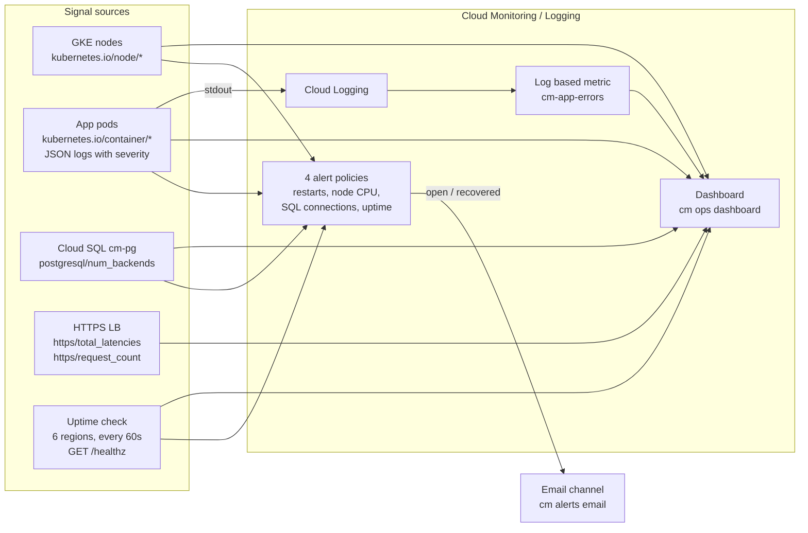
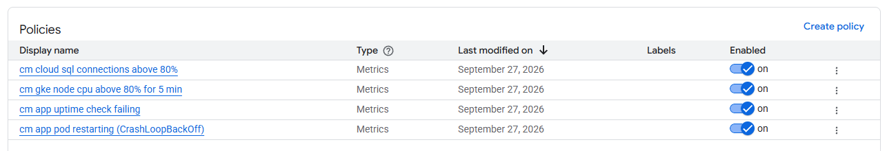
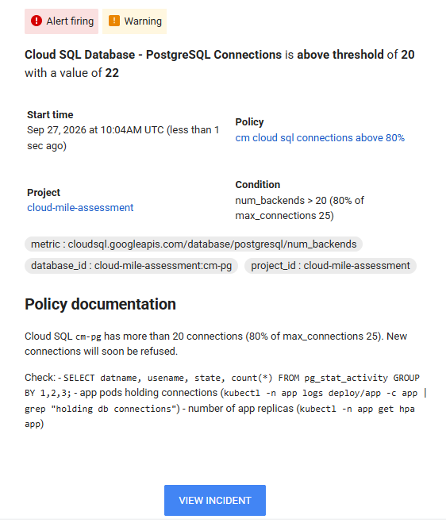
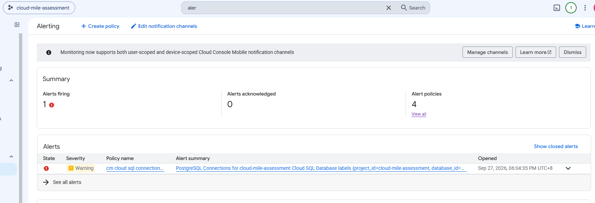
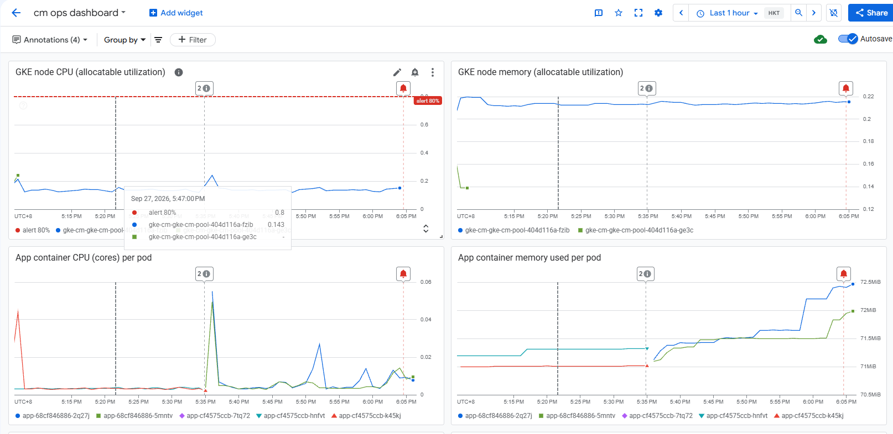
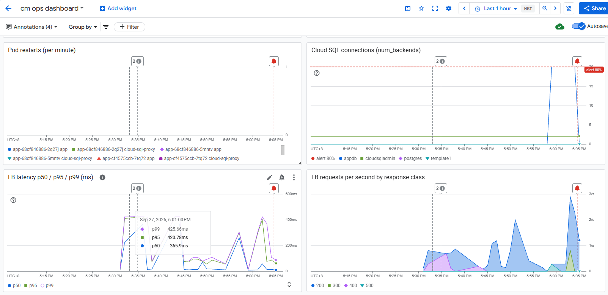
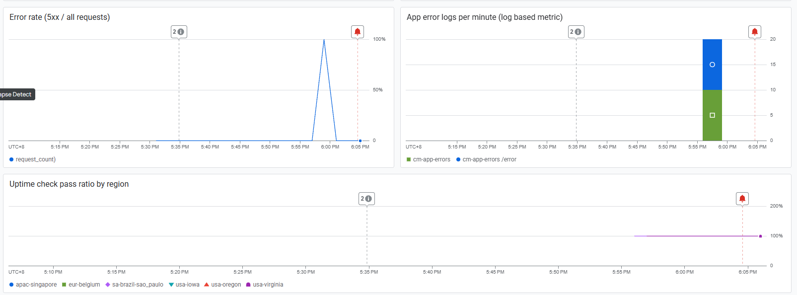
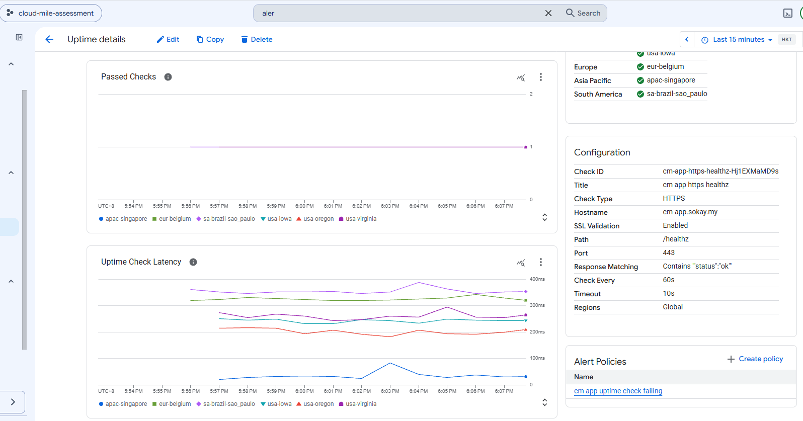
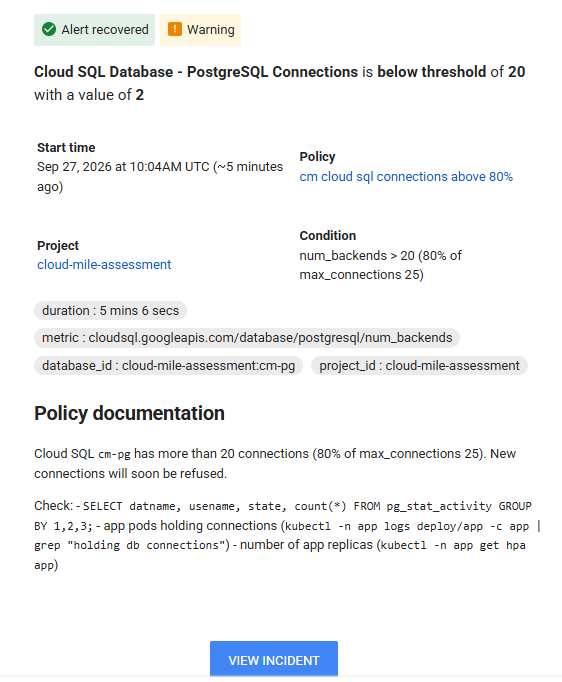
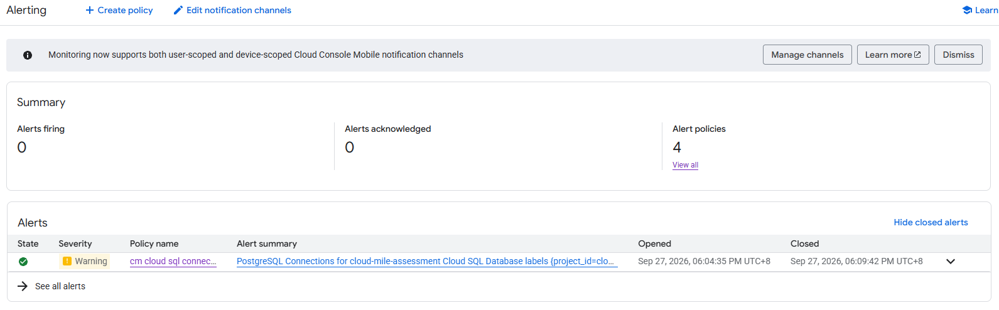

# 03. Task 3: Observability and Alerting

This document records how monitoring was built with Terraform (dashboard, alert policies, notification channel, uptime check, log based metric), how each piece was verified, and the timeline of an alert firing and resolving. Each step lists the commands run, the result, and where the raw output is stored.

All times in this document are MYT (UTC+8). Raw evidence files are captured in UTC.

## Summary

| Brief requirement | Implemented as | Evidence |
|-------------------|----------------|----------|
| Dashboard: GKE CPU/memory, pod restarts, Cloud SQL connections, latency, error rate | `cm ops dashboard`, 11 charts | [task3-04](../src/task3-04-dashboard-gke.png), [task3-05](../src/task3-05-dashboard-sql-lb.png), [task3-06](../src/task3-06-dashboard-errors-uptime.png) |
| Alert: CrashLoopBackOff or repeated pod restarts | `cm app pod restarting (CrashLoopBackOff)` | [08-gcloud-monitoring-resources.txt](../evidence/task-3/08-gcloud-monitoring-resources.txt) |
| Alert: node CPU above 80% for 5 minutes | `cm gke node cpu above 80% for 5 min` | same |
| Alert: Cloud SQL connections above 80% | `cm cloud sql connections above 80%` | same, fired and resolved (see timeline) |
| Alert: uptime check failure | `cm app uptime check failing` | same |
| At least one notification channel, verified | Email channel `cm alerts email` | Firing and recovered emails received: [task3-02](../src/task3-02-alert-email-firing.png), [task3-08](../src/task3-08-alert-email-recovered.png) |
| Log based metric for application errors, capturing data | `cm-app-errors` | [10-log-metric-evidence.txt](../evidence/task-3/10-log-metric-evidence.txt) |
| Uptime check with an attached alert policy | `cm app https healthz` on `https://cm-app.sokay.my/healthz` | [task3-07](../src/task3-07-uptime-check.png) |
| At least one alert firing and resolving, with a timeline | Cloud SQL connections alert, opened 18:04:35, closed 18:09:42 | [09-alert-sql-connections-timeline.txt](../evidence/task-3/09-alert-sql-connections-timeline.txt), [task3-03](../src/task3-03-alerting-incident-open.png), [task3-09](../src/task3-09-alerting-incident-closed.png) |
| gcloud outputs and console screenshots | List and full describe of every resource, 9 screenshots | [08-gcloud-monitoring-resources.txt](../evidence/task-3/08-gcloud-monitoring-resources.txt), [11-gcloud-monitoring-describe.txt](../evidence/task-3/11-gcloud-monitoring-describe.txt) |

Everything is in Terraform, in a new module [terraform/platform/modules/monitoring/](../terraform/platform/modules/monitoring/).

## Architecture (updated)



## Design

### Notification channel

| Setting | Value |
|---------|-------|
| Type | Email |
| Address | Set through the gitignored `admin.auto.tfvars` (`alert_email`, marked sensitive), so it is not in the public repository or evidence |
| Used by | All 4 alert policies |

Email channels need no verification code. The channel was verified end to end by receiving both the "Alert firing" and the "Alert recovered" emails during the test below.

### Log based metric

| Setting | Value |
|---------|-------|
| Name | `cm-app-errors` |
| Filter | `resource.type="k8s_container" AND resource.labels.cluster_name="cm-gke" AND resource.labels.namespace_name="app" AND resource.labels.container_name="app" AND severity>=ERROR` |
| Kind | Counter (DELTA, INT64) |
| Label | `path`, extracted from `jsonPayload.path` |

This works because the app writes JSON to stdout with a `severity` field, which Cloud Logging maps to the entry severity. No parsing rules are needed.

### Uptime check

| Setting | Value |
|---------|-------|
| Target | `https://cm-app.sokay.my/healthz`, port 443 |
| SSL validation | On (also catches an expired or wrong certificate) |
| Content match | Body contains `"status":"ok"` |
| Accepted status | 2xx |
| Period / timeout | 60s / 10s |
| Regions | Global (6 checkers: Singapore, Belgium, Sao Paulo, Iowa, Oregon, Virginia) |

### Alert policies

| Policy | Metric and condition | Why these numbers |
|--------|----------------------|-------------------|
| `cm app pod restarting (CrashLoopBackOff)`, severity ERROR | `kubernetes.io/container/restart_count`, delta over 5 min, summed per pod and container, **> 2** | CrashLoopBackOff is repeated restarts with growing back off (10s, 20s, 40s...), which gives 3 or more restarts inside 5 minutes. A single restart (for example a one off OOM) does not page. |
| `cm gke node cpu above 80% for 5 min`, severity WARNING | `kubernetes.io/node/cpu/allocatable_utilization`, 1 min mean per node, **> 0.8 for 300s** | Exactly the brief. Uses allocatable (what pods can actually use), not raw machine CPU. |
| `cm cloud sql connections above 80%`, severity WARNING | `cloudsql.googleapis.com/database/postgresql/num_backends`, summed across databases, **> 20 for 60s** | `SHOW max_connections` returned 25 on `db-f1-micro`, and 80% of 25 is 20. Cloud SQL has no built in percentage metric, so the threshold is computed in Terraform from `sql_max_connections`. |
| `cm app uptime check failing`, severity CRITICAL | `monitoring.googleapis.com/uptime_check/check_passed`, count of failing regions **> 1 for 60s** | Needs at least 2 regions failing, so one flaky checker location does not page. |

Every policy has `auto_close` after 30 minutes and a documentation block with the first commands to run, which is included in the alert email.

### Dashboard

`cm ops dashboard`, 11 charts:

| Chart | Metric |
|-------|--------|
| GKE node CPU (allocatable utilization), with the 80% alert line | `kubernetes.io/node/cpu/allocatable_utilization` |
| GKE node memory (allocatable utilization) | `kubernetes.io/node/memory/allocatable_utilization` |
| App container CPU per pod | `kubernetes.io/container/cpu/core_usage_time` (rate) |
| App container memory per pod | `kubernetes.io/container/memory/used_bytes` |
| Pod restarts per minute | `kubernetes.io/container/restart_count` (delta) |
| Cloud SQL connections, with the 80% alert line | `cloudsql.googleapis.com/database/postgresql/num_backends` |
| LB latency p50 / p95 / p99 | `loadbalancing.googleapis.com/https/total_latencies` |
| LB requests per second by response class | `loadbalancing.googleapis.com/https/request_count` |
| Error rate (5xx / all requests) | ratio of `request_count` with `response_code_class=500` to all |
| App error logs per minute | `logging.googleapis.com/user/cm-app-errors` |
| Uptime check pass ratio by region | `monitoring.googleapis.com/uptime_check/check_passed` |

The LB charts filter on the HTTPS URL map only (`k8s2-um-...`), so the HTTP to HTTPS redirect map (`k8s2-rm-...`) does not add 301s to the error rate or latency.

## Steps performed

### Step 1: Check the facts the alerts depend on

```bash
kubectl -n app exec <pod> -c app -- python -c "import main; ... SHOW max_connections ..."
curl -H "Authorization: Bearer $(gcloud auth print-access-token)" \
  https://monitoring.googleapis.com/v3/projects/cloud-mile-assessment/metricDescriptors/<metric>
```

| Check | Result |
|-------|--------|
| `SHOW max_connections` | 25 (plus `superuser_reserved_connections` = 3, so 22 usable by the app user) |
| Metric descriptors | All 7 metrics exist with the expected kind and type (for example `num_backends` GAUGE INT64 with label `database`) |
| LB series | Two URL maps: `k8s2-um-...` (HTTPS traffic) and `k8s2-rm-...` (redirect) |
| Cloud SQL baseline | 2 connections, both `cloudsqladmin` (Google's internal admin user) |

### Step 2: Terraform plan and apply

```bash
cd terraform/platform
terraform plan -out=platform.tfplan     # Plan: 8 to add
terraform apply platform.tfplan
```

The first apply created 6 of 8 resources and failed on the log based metric:

```
Error: Error creating Metric: googleapi: Error 400: Field not found: 'label'.
```

Root cause: Cloud Logging filters use `resource.labels.<name>` while Cloud Monitoring filters use `resource.label.<name>`. The log metric filter had reused the Monitoring style. After fixing the filter, a second plan created the remaining 2 (log metric and dashboard, which depends on it).

Raw output: [01-tf-plan-monitoring.txt](../evidence/task-3/01-tf-plan-monitoring.txt), [02-tf-apply-monitoring.txt](../evidence/task-3/02-tf-apply-monitoring.txt), [03-tf-plan-monitoring-fix.txt](../evidence/task-3/03-tf-plan-monitoring-fix.txt), [04-tf-apply-monitoring-fix.txt](../evidence/task-3/04-tf-apply-monitoring-fix.txt)

### Step 3: Remove plan drift

A follow up `terraform plan` was not clean. Two causes:

| Resource | Diff | Fix |
|----------|------|-----|
| Dashboard | The API adds `targetAxis = "Y1"` to every data set and drops `xPos` / `yPos` when they are 0 | Set `targetAxis` explicitly and leave out zero positions |
| 4 alert policies | The API strips the trailing newline from the heredoc documentation | Wrap the heredoc in `chomp()` |

After one apply of the documentation change, `terraform plan -detailed-exitcode` returned exit code 0 (no changes).

Raw output: [05-tf-plan-drift-fix.txt](../evidence/task-3/05-tf-plan-drift-fix.txt), [06-tf-apply-drift-fix.txt](../evidence/task-3/06-tf-apply-drift-fix.txt), [07-tf-plan-no-drift.txt](../evidence/task-3/07-tf-plan-no-drift.txt)

### Step 4: Verify with gcloud

```bash
gcloud beta monitoring channels list
gcloud alpha monitoring policies list
gcloud monitoring uptime list-configs
gcloud logging metrics describe cm-app-errors
gcloud monitoring dashboards list
```

Result: 1 email channel enabled, 4 policies enabled with the expected severities and conditions, 1 uptime check on `/healthz` port 443 every 60s, the log metric with the expected filter, and the dashboard.

Full configuration of every resource was then captured (alert email redacted):

```bash
gcloud beta monitoring channels describe <channel-id>
gcloud alpha monitoring policies describe <policy-id>      # x4
gcloud monitoring uptime describe cm-app-https-healthz-Hj1EXMaMD9s
gcloud logging metrics describe cm-app-errors
gcloud monitoring dashboards describe <dashboard-id>
```

Raw output: [08-gcloud-monitoring-resources.txt](../evidence/task-3/08-gcloud-monitoring-resources.txt), [11-gcloud-monitoring-describe.txt](../evidence/task-3/11-gcloud-monitoring-describe.txt)

### Step 5: Fire and resolve an alert (Cloud SQL connections)

The Cloud SQL connections alert was chosen because it can be triggered safely: the app keeps serving while the connections are held. Script: [demo-alert-sql.sh](../scripts/demo-alert-sql.sh).

```bash
scripts/demo-alert-sql.sh
# 1. baseline num_backends
# 2. 10 x GET /error with the chaos token through https://cm-app.sokay.my (feeds the log metric and 5xx rate)
# 3. GET /connections?n=20&seconds=360 on one pod (holds 20 DB connections for 6 minutes)
# 4. every 30s: num_backends from the Monitoring API, and /readyz status
```

20 was used instead of 22 on purpose. The app user can open 22 connections at most (25 minus 3 reserved for superusers). Holding all 22 would leave no connection for readiness checks, which would take every pod out of the load balancer and turn an alert test into an outage.

**Timeline (MYT)**

| Time | Event | Source |
|------|-------|--------|
| 17:57:56 | Baseline: 2 connections (`cloudsqladmin` 2, `appdb` 0) | timeline file |
| 17:57:57 | 10 x `GET /error` through HTTPS, all `500` | timeline file |
| 17:57:59 | Start holding 20 connections from pod `app-68cf846886-2q27j` | timeline file |
| 18:00:06 | Monitoring API shows 22 connections (`appdb` 20 + `cloudsqladmin` 2), above the threshold of 20 | timeline file |
| 18:03:59 | Connections released (end of the 360s hold) | script |
| 18:04:35 | **Alert opened**, email "Alert firing ... above threshold of 20 with a value of 22" | alerting console, email |
| 18:05:57 | Monitoring API back to 2 connections | timeline file |
| 18:09:42 | **Alert closed**, email "Alert recovered ... below threshold of 20 with a value of 2", duration 5 min 6 s | alerting console, email |
| whole test | `/readyz` returned 200 every 30s, no user impact | timeline file |

Observations:
- **Detection delay.** The connections went up at 17:57:59 but the alert opened at 18:04:35. Cloud SQL metrics are sampled every 60 seconds and arrive about 2 minutes late, then the condition needs 60 seconds above the threshold. This alert is meant for sustained pressure, not a short spike. For faster detection, the app could export its own connection pool metric.
- **Early warning worked.** The alert fired at 80% while the app was still healthy, which is the point of alerting before the hard limit.

Raw output: [09-alert-sql-connections-timeline.txt](../evidence/task-3/09-alert-sql-connections-timeline.txt)

### Step 6: Log based metric captures data

```bash
gcloud logging read 'resource.type="k8s_container" AND resource.labels.namespace_name="app"
  AND resource.labels.container_name="app" AND severity>=ERROR
  AND timestamp>="2026-09-27T09:57:00Z" AND timestamp<="2026-09-27T09:59:00Z"'
# plus the Monitoring API time series for logging.googleapis.com/user/cm-app-errors
```

| Check | Result |
|-------|--------|
| Matching log entries | 20. Each `/error` request writes 2 ERROR lines: `simulated application error` and the access log line `GET /error 500` |
| Metric series | 4 series, 5 each: `path=/error` and no path, on each of the 2 pods (the LB spread the 10 requests evenly) |
| Dashboard | "App error logs per minute" shows 20 at 17:58, split by path |

Raw output: [10-log-metric-evidence.txt](../evidence/task-3/10-log-metric-evidence.txt)

## Console screenshots

**Alert policies** (all 4 enabled)



**Alert firing email** (18:04 MYT, value 22 over threshold 20, with the runbook from the policy documentation)



**Alerting console, alert open**



**Dashboard: GKE node CPU and memory, app container CPU and memory**



**Dashboard: pod restarts, Cloud SQL connections crossing the 80% line, LB latency, LB requests by response class**



**Dashboard: error rate spike from the `/error` calls, app error logs (log based metric), uptime pass ratio**



**Uptime check** (passing from all 6 regions, attached to `cm app uptime check failing`)



**Alert recovered email** (below threshold with a value of 2, duration 5 min 6 s)



**Alerting console, alert closed** (opened 18:04:35, closed 18:09:42)



## Notes

- **Added in Task 4.** A fifth alert policy, `cm vpc firewall rule changed`, alerts on any VPC firewall change from the audit log.
- The page's "hold db conns" chaos button was changed from 22 to 20 in the app source for the reason above. It will ship with the next image build.
- The uptime alert fired twice after this: during the Task 5 scale to zero test (18:46:35 to 18:46:58) and during the Task 4 firewall incident (19:13:42 to 19:22:51).

## Evidence index

| File | Content |
|------|---------|
| [01-tf-plan-monitoring.txt](../evidence/task-3/01-tf-plan-monitoring.txt) | Plan, 8 to add |
| [02-tf-apply-monitoring.txt](../evidence/task-3/02-tf-apply-monitoring.txt) | First apply, log metric filter error |
| [03-tf-plan-monitoring-fix.txt](../evidence/task-3/03-tf-plan-monitoring-fix.txt) | Plan after the filter fix, 2 to add |
| [04-tf-apply-monitoring-fix.txt](../evidence/task-3/04-tf-apply-monitoring-fix.txt) | Apply, log metric and dashboard created |
| [05-tf-plan-drift-fix.txt](../evidence/task-3/05-tf-plan-drift-fix.txt) | Plan for the documentation newline fix |
| [06-tf-apply-drift-fix.txt](../evidence/task-3/06-tf-apply-drift-fix.txt) | Apply, 4 policies updated |
| [07-tf-plan-no-drift.txt](../evidence/task-3/07-tf-plan-no-drift.txt) | Final plan, no changes |
| [08-gcloud-monitoring-resources.txt](../evidence/task-3/08-gcloud-monitoring-resources.txt) | Channels, policies, uptime check, log metric, dashboard |
| [09-alert-sql-connections-timeline.txt](../evidence/task-3/09-alert-sql-connections-timeline.txt) | Alert test timeline (UTC) |
| [10-log-metric-evidence.txt](../evidence/task-3/10-log-metric-evidence.txt) | Error log entries and log metric time series |
| [11-gcloud-monitoring-describe.txt](../evidence/task-3/11-gcloud-monitoring-describe.txt) | Full describe of channel, 4 policies, uptime check, log metric, dashboard |
