# 04. Task 4: Break / Fix / RCA

This document is the incident report for one injected fault: a VPC firewall rule that blocks Google load balancer and health check traffic (fault menu item **1b, Networking: add a firewall rule that blocks health check traffic**). It covers the injection, symptoms, diagnosis, root cause with 5 Whys, the fix, and the preventive controls (verified by re-injecting the same fault).

All times in this document are MYT (UTC+8). Raw evidence files are in [evidence/task-4/](../evidence/task-4/); some are captured in UTC and converted here.

## Incident summary

| Item | Value |
|------|-------|
| Fault | Manual VPC firewall rule `sec-deny-untrusted-ranges`: DENY tcp from `35.191.0.0/16`, `130.211.0.0/22` to tag `cm-gke-node`, priority 100 |
| Impact | `https://cm-app.sokay.my` returned 502 for every request |
| User impact window | 19:10:35 to 19:20:33 (first to last 5xx in the load balancer log), about 10 minutes, 128 failed requests |
| Detected by | Endpoint watcher 14s after the change; uptime alert (CRITICAL, email) at 19:13:42; health check script `endpoint` fail |
| Root cause | A higher precedence deny rule dropped the source ranges Google's load balancer and health checkers use, so no traffic could reach the pods while the pods themselves were healthy |
| Fix | Delete the rule. Service recovered 6 seconds after the delete |
| Preventive controls | 1) Health check allow rule moved to priority 0 in Terraform (re-injecting the same deny rule caused no impact). 2) New alert on any VPC firewall change, from the audit log (fired at 19:26:16) |

Note on duration: the diagnosis was complete by about 19:12 (root cause confirmed by the Connectivity Test at 19:11:44). The fault was then left in place until 19:20 on purpose so console screenshots could be captured. In a real incident the fix would have gone in at around 19:12, giving about 2 minutes of impact.

## Why this fault

- It is a realistic change: during "security hardening", unfamiliar public ranges get blocked. `35.191.0.0/16` and `130.211.0.0/22` do not look like anything the app talks to, but they are where Google's load balancer proxies (GFE) and health checkers connect from.
- It produces the most confusing kind of outage: Kubernetes, the pods, the database and the app all look healthy, yet every user gets a 502. It tests whether the monitoring can tell "app broken" from "path to the app broken".
- It exercises the Task 3 uptime alert and the Task 5 health check end to end.

## Environment before the fault (19:09:30)

```bash
kubectl -n app get pods -o wide
gcloud compute backend-services get-health k8s1-75b98460-app-app-80-a291f78d --global
gcloud compute firewall-rules list --filter="network:cm-vpc" --sort-by=priority
curl -s -o /dev/null -w "%{http_code} %{time_total}s" https://cm-app.sokay.my/healthz
gcloud network-management connectivity-tests describe lb-hc-to-app-pod
scripts/healthcheck.py
```

| Check | Result |
|-------|--------|
| Pods | 2/2 Running, one per node (`89c9`, `fzib`) |
| LB backend health | HEALTHY, HEALTHY |
| Firewall rules on `cm-vpc` | 5 rules, all ALLOW, all priority 1000 |
| HTTPS | 200 in 0.13s |
| Connectivity Test (GFE / health check prober `35.191.0.1` to pod `10.20.0.11:8080`) | REACHABLE, allowed by GKE's rule `k8s-fw-l7--75b98460862e98ad` |
| Health check script | `overall: pass`, exit 0 |

The Connectivity Test `lb-hc-to-app-pod` was created before the fault (after enabling `networkmanagement.googleapis.com` in the bootstrap Terraform) so the same test could be re-run during the incident.

Raw output: [01-before-state.txt](../evidence/task-4/01-before-state.txt), [00-tf-plan-bootstrap-api.txt](../evidence/task-4/00-tf-plan-bootstrap-api.txt), [00-tf-apply-bootstrap-api.txt](../evidence/task-4/00-tf-apply-bootstrap-api.txt)

## Injection (19:10:28)

A watcher was started first ([scripts/task4-watch.sh](../scripts/task4-watch.sh)): the public endpoint every 10 seconds and the LB backend health every 30 seconds.

```bash
gcloud compute firewall-rules create sec-deny-untrusted-ranges \
  --network=cm-vpc --direction=INGRESS --action=DENY --rules=tcp --priority=100 \
  --source-ranges=35.191.0.0/16,130.211.0.0/22 --target-tags=cm-gke-node \
  --description="security hardening: block untrusted external ranges"
```

Created at 19:10:35 (audit log `v1.compute.firewalls.insert` at 19:10:34). Done with gcloud on purpose, as a manual change outside Terraform.

Raw output: [02-fault-injection.txt](../evidence/task-4/02-fault-injection.txt)

## Symptoms

| Where | What was seen |
|-------|---------------|
| Browser | Google's `Error: Server Error ... Please try again in 30 seconds`, `502 Bad Gateway` from `8.232.93.111:443` |
| Endpoint watcher | 200 at 19:10:29, then 502 from 19:10:49 onward. The first failing sample took 9.1s (the proxy waiting on connections that never completed) |
| LB request log | 18 x `502 failed_to_connect_to_backend` starting 19:10:35, then 110 x `502 failed_to_pick_backend` once all backends were marked unhealthy |
| LB backend health | UNHEALTHY on every endpoint, console shows 0 healthy |
| Uptime check | Failing in all 6 regions, percent uptime dropped to 82% in the 15 minute view |
| Alert | `cm app uptime check failing` (CRITICAL) opened 19:13:42, email sent |
| Dashboard | Error rate (5xx / all) went to 100%, LB latency p95/p99 jumped to about 12s, 5xx in the requests chart |
| Health check script | `overall: fail`, exit 1, **only** `endpoint` failed: `pods`, `hpa`, `cloudsql` all pass |
| Kubernetes | Nothing: pods Running and Ready, 0 restarts, no new events |

## Diagnosis (started 19:11:23)

Each step with the command and the reasoning. Raw output: [04-diagnosis.txt](../evidence/task-4/04-diagnosis.txt).

| # | Question | Command | Result | Reasoning |
|---|----------|---------|--------|-----------|
| 1 | What do users see? | `curl -sS -w "http=%{http_code}" https://cm-app.sokay.my/healthz` | `502` | Confirms the outage from outside |
| 2 | Is Kubernetes healthy? | `kubectl -n app get pods -o wide`, `kubectl -n app get events` | 2/2 Running and Ready, 0 restarts, no events in the last 45 min | Not a crash, not a bad deploy |
| 3 | Does the app answer inside the cluster? | `kubectl exec ... urlopen('http://localhost:8080/healthz')` and `http://app.app.svc.cluster.local/readyz` | `200 {"status":"ok"}`, `200 {"status":"ready"}` | App and Service work, including the DB path (`/readyz` queries Cloud SQL). The break is between the internet and the pods |
| 4 | What does the health check script say? | `scripts/healthcheck.py` | Only `endpoint` fails | Same conclusion, in one command |
| 5 | Does the LB think the backends are healthy? | `gcloud compute backend-services get-health k8s1-75b98460-app-app-80-a291f78d --global` | UNHEALTHY, UNHEALTHY | Pods are Ready in Kubernetes but fail the LB's own health check: the LB cannot reach them |
| 6 | What does the LB log say? | `gcloud logging read 'resource.type="http_load_balancer" AND httpRequest.status>=500'` | `502 failed_to_pick_backend` | No healthy backend to send to |
| 7 | What changed recently? | `gcloud logging read` on the admin activity audit log for `compute.googleapis.com` | `v1.compute.firewalls.insert` of `sec-deny-untrusted-ranges` at 19:10:34 | A firewall change seconds before the first 502 |
| 8 | Which rules apply, in which order? | `gcloud compute firewall-rules list --filter=network:cm-vpc --sort-by=priority` | `sec-deny-untrusted-ranges` priority 100, DENY tcp from `35.191.0.0/16,130.211.0.0/22` to `cm-gke-node` | Lowest number wins; 100 beats the allow rules at 1000. These are exactly the GFE and health check source ranges |
| 9 | Prove it | `gcloud network-management connectivity-tests rerun lb-hc-to-app-pod` | **UNREACHABLE**, step `APPLY_INGRESS_FIREWALL_RULE`: `action: DENY`, `displayName: sec-deny-untrusted-ranges`, state `DROP` | Google's own analysis names the rule that drops the packet |

## Root cause analysis

### Timeline (MYT)

| Time | Event | Source |
|------|-------|--------|
| 19:09:30 | Before state captured, all healthy | 01-before-state |
| 19:10:28 | Injection command run | 02-fault-injection |
| 19:10:34 | Audit log: `firewalls.insert sec-deny-untrusted-ranges` | 04-diagnosis step 7 |
| 19:10:35 | First 502 (`failed_to_connect_to_backend`) in the LB log; user impact starts | 15-lb-5xx-summary |
| 19:10:49 | Watcher sees 502 (previous sample 19:10:29 was 200) | 03-symptom-watch |
| 19:11:23 | Diagnosis started | 04-diagnosis |
| 19:11:44 | Connectivity Test: UNREACHABLE, dropped by `sec-deny-untrusted-ranges`. Root cause confirmed | 04-diagnosis step 9 |
| 19:13:42 | Alert `cm app uptime check failing` (CRITICAL) opened, email sent | 13-alerts-api |
| 19:18:35 | Health check script: only `endpoint` failed, exit 1 | 05-healthcheck-during-fault-user-run |
| 19:20:32 | Fix: delete the rule | 06-fix |
| 19:20:33 | Last 502 in the LB log | 15-lb-5xx-summary |
| 19:20:37 | Rule deleted | 06-fix |
| 19:20:43 | Watcher: 200. Service restored | 03-symptom-watch |
| 19:21:05 | After state: backends HEALTHY, Connectivity Test REACHABLE, health check pass | 07-after-fix |
| 19:22:46 | Preventive control applied: `cm-allow-health-checks` priority 1000 to 0 | 09-tf-apply-preventive, audit log |
| 19:22:51 | Uptime alert closed, "Alert recovered" email, duration 9 min 9 s | 13-alerts-api, alert email |
| 19:23:25 | Verification: same deny rule re-injected | 10-verify-prevention |
| 19:23:24 to 19:25:24 | Every sample 200, backends HEALTHY | 11-verify-watch |
| 19:25:49 | Re-injected rule removed (rollback) | 12-rollback |
| 19:26:16 | Alert `cm vpc firewall rule changed` opened for the 19:25:49 delete (new detective control; the 19:23:26 insert came too soon after the policy was created to be matched) | 13-alerts-api, alert email |

| Metric | Value |
|--------|-------|
| Time to impact | under 1 second after the rule was created |
| Time to detect (watcher / health check) | 14 seconds |
| Time to detect (alert) | 3 min 7 s after the first 502 |
| Time to root cause | about 1 min 9 s (19:10:35 to 19:11:44) |
| Time to recover after the fix | 6 seconds |

### 5 Whys

1. **Why did users get 502?**
   The load balancer had no healthy backend to send requests to (`failed_to_pick_backend`), and before the health checks caught up, it could not connect to the backends (`failed_to_connect_to_backend`).
2. **Why were there no healthy backends when both pods were Ready?**
   The load balancer's health check probes and its proxy traffic could not reach the pods. Kubernetes readiness is checked by the kubelet on the node, so it stayed green; the LB health check comes from outside the node.
3. **Why could that traffic not reach the pods?**
   Google's load balancer proxies and health checkers connect from `35.191.0.0/16` and `130.211.0.0/22`. A new rule, `sec-deny-untrusted-ranges`, denied TCP from exactly those ranges to every GKE node (`cm-gke-node`) at priority 100. VPC firewall rules are evaluated by priority, lowest number first, so it overrode every allow rule, all at priority 1000.
4. **Why was a rule like that created?**
   It was a manual "security hardening" change made with gcloud, outside Terraform, without review. Whoever made it treated the Google ranges as unknown external traffic, not knowing they are the load balancer's source ranges.
5. **Why did nothing stop it or flag it straight away?**
   - The rule that must never be overridden (health check allow) had the default priority 1000, so any lower number could beat it.
   - Terraform only tracks resources it manages. An extra rule created by hand is not drift and never shows up in `terraform plan`.
   - There was no alert on firewall changes, only on symptoms. The uptime alert fired about 3 minutes after impact.

### Root cause

A manually created VPC firewall deny rule with higher precedence (priority 100) than the load balancer allow rules blocked the Google Front End and health check source ranges to all GKE nodes. Contributing factors: the critical allow rule used the default priority, firewall changes could be made outside Terraform without review, and firewall changes were not monitored.

## Fix (19:20:32)

```bash
gcloud compute firewall-rules delete sec-deny-untrusted-ranges --quiet
```

Proof of recovery (19:21:05):

| Check | Result |
|-------|--------|
| Watcher | 200 from 19:20:43 |
| LB backend health | HEALTHY, HEALTHY |
| Firewall rules | Deny rule gone, back to the original 5 |
| Connectivity Test | REACHABLE |
| Health check script | `overall: pass`, exit 0 |
| Uptime alert | Closed 19:22:51 |

Raw output: [06-fix.txt](../evidence/task-4/06-fix.txt), [07-after-fix.txt](../evidence/task-4/07-after-fix.txt), [03-symptom-watch.txt](../evidence/task-4/03-symptom-watch.txt)

## Preventive controls (implemented)

All in Terraform, applied at 19:22:46 (`terraform plan` clean afterwards).

### 1. Prevent: the health check allow rule can no longer be overridden by ordinary deny rules

[modules/network/main.tf](../terraform/platform/modules/network/main.tf), `cm-allow-health-checks`:

```hcl
# from task 4 - was 1000, a manual deny at priority 100 cut off the lb (502 for ~10 min)
# 0 = highest, lowest number wins so only a deny also at 0 can override this now
priority = 0
```

GCP evaluates firewall rules from priority 0 upwards and uses the first match. With the allow at 0, a deny at any priority from 1 to 65535 no longer affects the LB ranges. A deny at exactly 0 would still win (deny wins a tie), which is a deliberate and very visible choice rather than an accident.

**Verified by re-injecting the exact same rule** at 19:23:25:

| Check | Result |
|-------|--------|
| Firewall rules | `cm-allow-health-checks` priority 0 and `sec-deny-untrusted-ranges` priority 100 both present |
| Watcher, 19:23:24 to 19:25:24 | Every sample 200, backends HEALTHY |
| Connectivity Test | REACHABLE, the trace now shows the traffic allowed by `cm-allow-health-checks` |
| Health check script | `overall: pass`, exit 0 |

Raw output: [10-verify-prevention.txt](../evidence/task-4/10-verify-prevention.txt), [11-verify-watch.txt](../evidence/task-4/11-verify-watch.txt)

### 2. Detect: alert on any VPC firewall change

[modules/monitoring/main.tf](../terraform/platform/modules/monitoring/main.tf), `cm vpc firewall rule changed` (severity WARNING, email). A log match condition on the admin activity audit log:

```
logName="projects/cloud-mile-assessment/logs/cloudaudit.googleapis.com%2Factivity"
AND protoPayload.serviceName="compute.googleapis.com"
AND protoPayload.methodName=~"compute\.firewalls\.(insert|patch|update|delete)"
AND NOT protoPayload.authenticationInfo.principalEmail=~"container-engine-robot"
```

GKE's own service agent is excluded because it manages the `gke-*` and `k8s-fw-*` rules on every cluster and ingress change. The email includes the rule name, the method and who made the change (label extractors), plus a short runbook. Notifications are rate limited to one per 5 minutes.

It fired at 19:26:16 for the rollback of the verification change (`v1.compute.firewalls.delete` of `sec-deny-untrusted-ranges`, labels `actor`, `method`, `rule` in the email). The re-injection itself (`insert` at 19:23:26) was not alerted: it happened about 40 seconds after Terraform created the policy, and a new log based alert policy takes a few minutes before it starts matching entries. From then on, every non GKE firewall change is caught. Had it existed during the incident, it would have named the rule at the same time as the first symptoms.

### Existing controls that worked

- Uptime check and alert (Task 3) caught the outage from 6 regions.
- The health check script (Task 5) failed only on `endpoint`, which pointed straight at the network path instead of the app.

### Recommended, not implemented here

| Control | Why not now |
|---------|-------------|
| Only a CI or Terraform service account may change firewall rules (`compute.securityAdmin` removed from people) | Single person sandbox: the same account runs Terraform |
| Hierarchical firewall policy at folder or org level that always allows the Google LB ranges | Needs an organization; this is a standalone project |
| Enable firewall rule logging on deny rules | Adds logging cost; the Connectivity Test gave the same answer during diagnosis |
| Change review for firewall changes (pull request plus `terraform plan`) | Process control, noted for a team setup |

## Screenshots

**The deny rule at priority 100, above every allow rule**

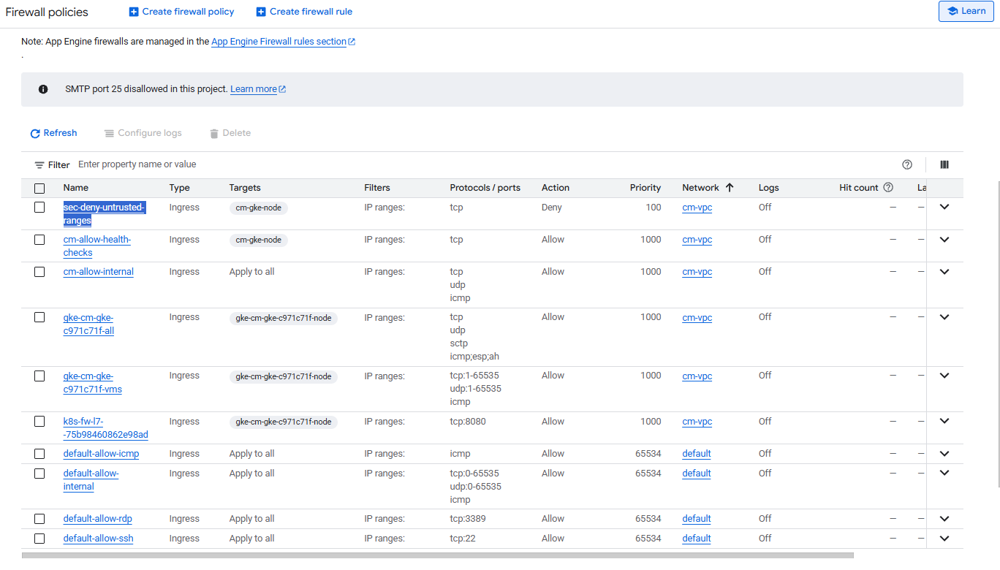

**What users saw: 502 from the load balancer**

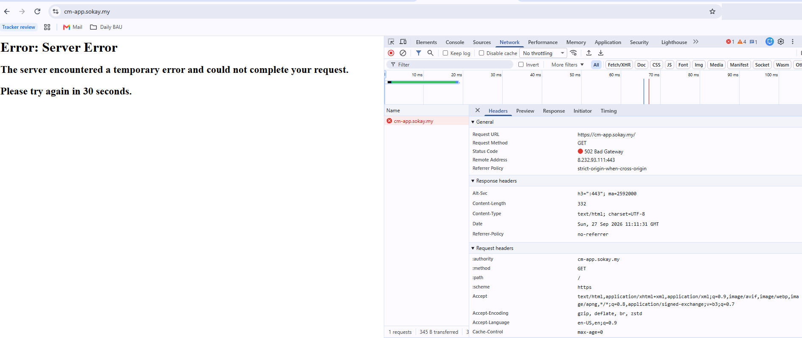

**LB backends: 0 healthy**

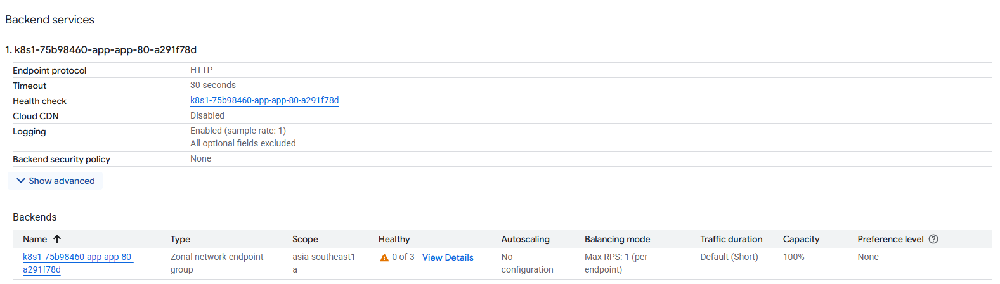

**Uptime check failing in every region**

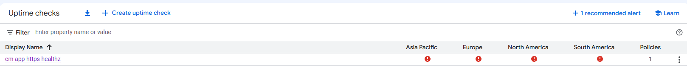

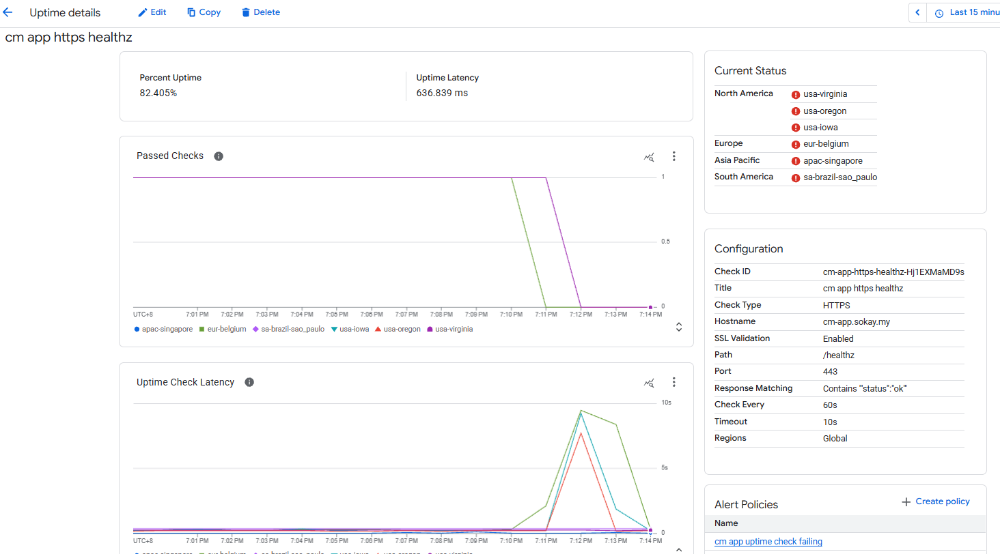

**Connectivity Test: packet from the Google service dropped by an ingress firewall rule**

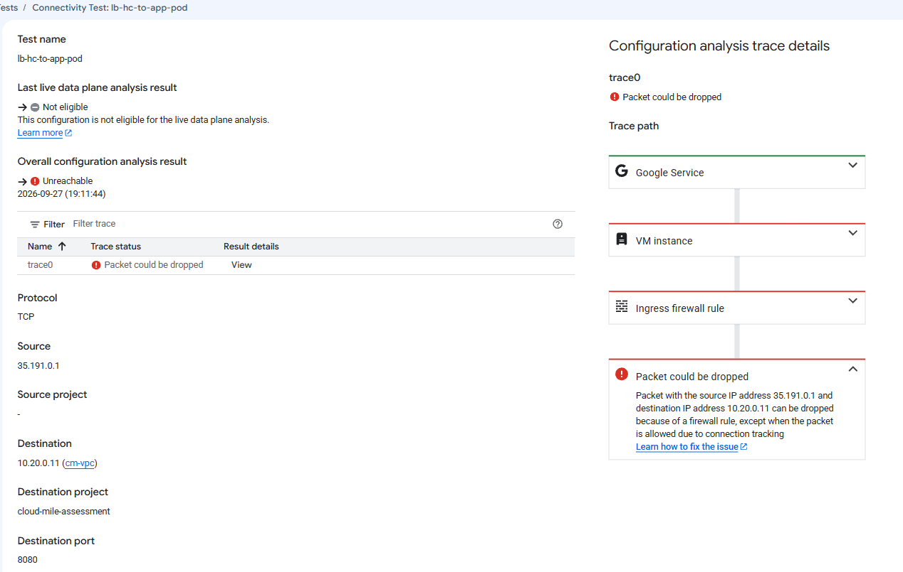

**Dashboard: uptime alert firing (opened 7:13 PM)**

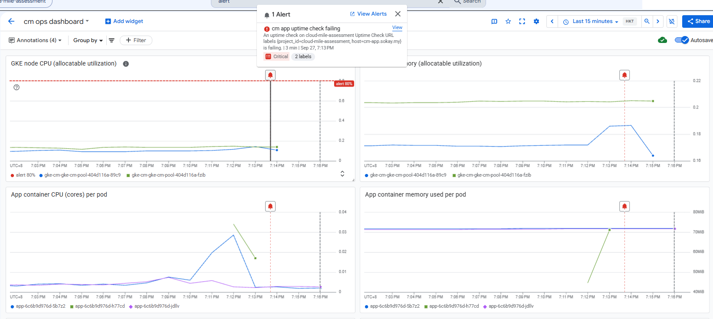

**Dashboard: LB latency spike, 5xx, error rate 100%**

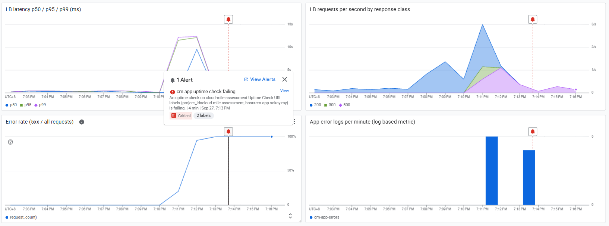

**Uptime alert recovered email** (opened 11:13 UTC = 19:13 MYT, duration 9 min 9 s)

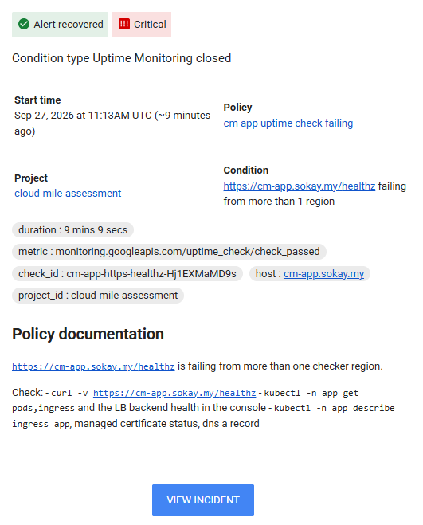

**Firewall change alert email** (new detective control; rule, method and actor in the labels, actor redacted)

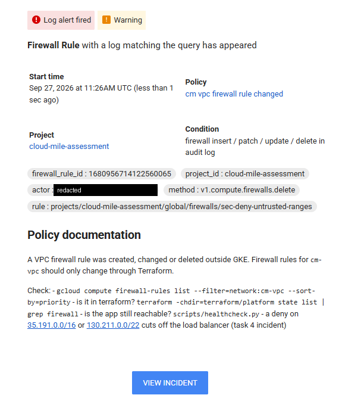

**Alerting console: all incidents of the day** (firewall change open, uptime 19:13:42 to 19:22:51 for this incident, uptime 18:46 from Task 5, Cloud SQL 18:04 from Task 3; 5 policies)

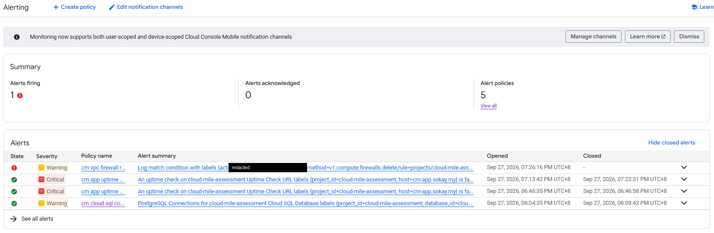

## Evidence index

| File | Content |
|------|---------|
| [00-tf-plan-bootstrap-api.txt](../evidence/task-4/00-tf-plan-bootstrap-api.txt) | Plan to enable `networkmanagement.googleapis.com` |
| [00-tf-apply-bootstrap-api.txt](../evidence/task-4/00-tf-apply-bootstrap-api.txt) | Apply for the API |
| [01-before-state.txt](../evidence/task-4/01-before-state.txt) | Before state |
| [02-fault-injection.txt](../evidence/task-4/02-fault-injection.txt) | Injection command and timestamps |
| [03-symptom-watch.txt](../evidence/task-4/03-symptom-watch.txt) | Endpoint and backend health every 10s, whole incident |
| [04-diagnosis.txt](../evidence/task-4/04-diagnosis.txt) | All diagnosis commands and outputs |
| [05-healthcheck-during-fault-user-run.txt](../evidence/task-4/05-healthcheck-during-fault-user-run.txt) | Health check script during the fault |
| [06-fix.txt](../evidence/task-4/06-fix.txt) | Fix command and timestamps |
| [07-after-fix.txt](../evidence/task-4/07-after-fix.txt) | After state |
| [08-tf-plan-preventive.txt](../evidence/task-4/08-tf-plan-preventive.txt) | Plan for the preventive controls |
| [09-tf-apply-preventive.txt](../evidence/task-4/09-tf-apply-preventive.txt) | Apply for the preventive controls |
| [10-verify-prevention.txt](../evidence/task-4/10-verify-prevention.txt) | Re-injection with the controls in place |
| [11-verify-watch.txt](../evidence/task-4/11-verify-watch.txt) | Endpoint and backend health during the re-injection |
| [12-rollback.txt](../evidence/task-4/12-rollback.txt) | Rollback of the re-injected rule, firewall audit trail |
| [13-alerts-api.txt](../evidence/task-4/13-alerts-api.txt) | Alert incidents with open and close times |
| [14-final-healthcheck.txt](../evidence/task-4/14-final-healthcheck.txt) | Final health check |
| [15-lb-5xx-summary.txt](../evidence/task-4/15-lb-5xx-summary.txt) | LB 5xx count by `statusDetails`, first and last |
