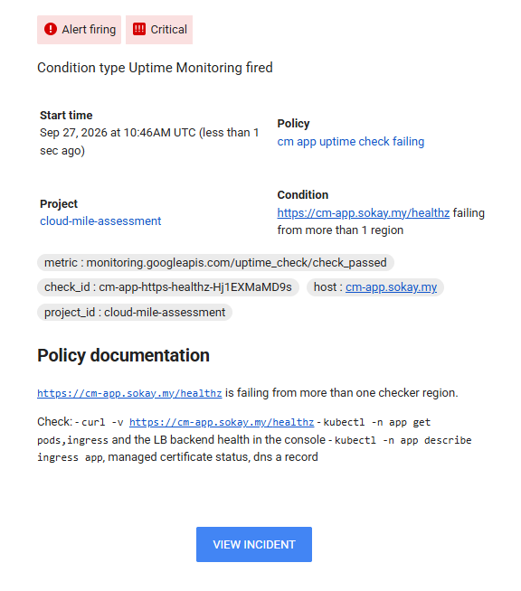
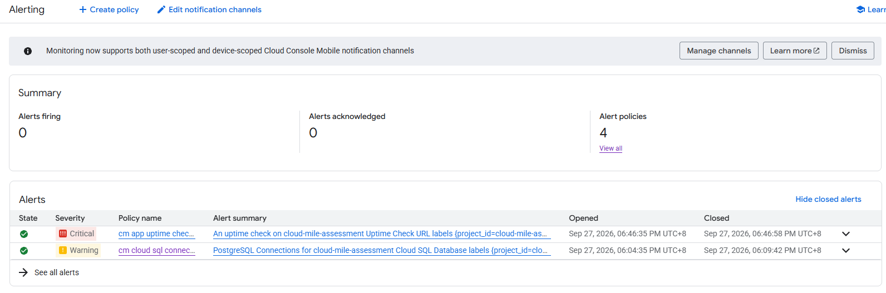

# 05. Task 5: Automation Script (Health Check)

This document describes the health check script, shows it passing and failing, and records the two real problems it found while it was being tested. Each step lists the commands run, the result, and where the raw output is stored.

All times in this document are MYT (UTC+8). The script itself prints timestamps in MYT (`+08:00`).

## Summary

| Brief requirement | Implemented as | Evidence |
|-------------------|----------------|----------|
| Bash or Python script | [scripts/healthcheck.py](../scripts/healthcheck.py), Python 3, standard library only | |
| Checks pod status | `pods` check | [08-run-pass.txt](../evidence/task-5/08-run-pass.txt) |
| Checks HPA | `hpa` check | same |
| Checks Cloud SQL connectivity | `cloudsql` check: instance state plus a real query through the app pod and the Auth Proxy | same |
| Checks application endpoint | `endpoint` check: `https://cm-app.sokay.my/healthz`, status, body, latency, TLS certificate | same |
| Outputs JSON | Single JSON document on stdout | all run files |
| Exits non zero on failure | `0` healthy, `1` a check failed, `2` the script could not run | all run files |
| Show it running successfully | `overall: pass`, exit 0 | [08-run-pass.txt](../evidence/task-5/08-run-pass.txt) |
| Show it failing | `overall: fail`, exit 1 (deployment scaled to 0) | [10-run-fail-scale-to-zero.txt](../evidence/task-5/10-run-fail-scale-to-zero.txt) |

A second failing run, from a real injected fault, is recorded in Task 4.

## Usage

```bash
# from WSL, with kubectl pointed at cm-gke and gcloud logged in
scripts/healthcheck.py                 # all defaults for this environment
scripts/healthcheck.py --strict        # warnings also exit 1
scripts/healthcheck.py --help

# typical use in automation
scripts/healthcheck.py > report.json || echo "unhealthy, exit $?"
scripts/healthcheck.py | jq -r '.checks[] | "\(.name)\t\(.status)\t\(.summary)"'
```

| Option | Default | Meaning |
|--------|---------|---------|
| `--namespace` | `app` | Namespace of the app |
| `--selector` | `app=cm-app` | Label selector for the app pods |
| `--hpa` | `app` | HPA name |
| `--min-ready` | `2` | Ready pods required (matches HPA `minReplicas`) |
| `--project` | `cloud-mile-assessment` | GCP project |
| `--sql-instance` | `cm-pg` | Cloud SQL instance |
| `--url` | `https://cm-app.sokay.my` | Public base URL |
| `--timeout` | `20` | Seconds per command or request |
| `--max-latency-ms` | `1000` | Endpoint latency that triggers a warning |
| `--strict` | off | Treat warnings as failures |

Requirements: `python3`, `kubectl` with access to the cluster, `gcloud` with access to the project. No pip packages.

## What each check does

| Check | How | Fail when | Warn when |
|-------|-----|-----------|-----------|
| `pods` | `kubectl get pods -l app=cm-app -o json`. Reads the Ready condition and every container status, including the Cloud SQL proxy native sidecar (reported under `initContainerStatuses`). Pods that are shutting down (`deletionTimestamp` set) are listed separately and not counted. | Fewer ready pods than `--min-ready`, or any container waiting in `CrashLoopBackOff`, `ImagePullBackOff`, `ErrImagePull`, `CreateContainerConfigError`, `CreateContainerError`, `InvalidImageName` | A container restarted in the last 15 minutes, or all ready pods are on one node |
| `hpa` | `kubectl get hpa app -o json`. Reads min, max, current, desired, current CPU against target, and the conditions. | `AbleToScale` or `ScalingActive` is not `True` (for example missing resource requests or no metrics), or no current CPU metric | `ScalingLimited=True` with reason `TooManyReplicas` (pinned at max) |
| `cloudsql` | `gcloud sql instances describe cm-pg`, then `kubectl exec` into a live app pod and call `GET localhost:8080/db`, which runs a real query through the Auth Proxy sidecar. If a pod disappears between listing and exec, the next pod is tried. | Instance state is not `RUNNABLE`, no live pod to test from, or the query returns anything other than 200 with DB data | |
| `endpoint` | `GET https://cm-app.sokay.my/healthz` from the machine running the script, plus a TLS handshake to read the certificate expiry | Not 200, body does not contain `"status":"ok"`, unreachable, or TLS error | Latency over `--max-latency-ms`, or certificate expires in under 14 days |

Each check is independent and wrapped so that one broken check still lets the others run and report.

## Output format

```json
{
  "timestamp": "2026-09-27T18:44:13+08:00",
  "target": { "namespace": "app", "hpa": "app", "sql_instance": "cm-pg", "url": "https://cm-app.sokay.my" },
  "overall": "pass | warn | fail",
  "failed_checks": [],
  "warning_checks": [],
  "duration_ms": 1430,
  "checks": [
    {
      "name": "pods | hpa | cloudsql | endpoint",
      "status": "pass | warn | fail",
      "summary": "one line for humans",
      "messages": ["reasons for warn or fail"],
      "duration_ms": 411,
      "details": { "check specific data" }
    }
  ]
}
```

| Exit code | Meaning |
|-----------|---------|
| `0` | All checks pass, or only warnings (without `--strict`) |
| `1` | At least one check failed (or a warning with `--strict`) |
| `2` | The script could not run (for example `kubectl` or `gcloud` missing) |

## Steps performed

### Step 1: First run, pass

```bash
scripts/healthcheck.py; echo "exit code: $?"
```

Result: `overall: pass`, exit 0, 3.9 seconds (this first run was printed to the terminal only, not saved). It also showed that both pods were on the same node, `gke-cm-gke-cm-pool-404d116a-fzib`. A single node failure would have taken the app down even with 2 replicas. A `warn` for this case was added to the `pods` check.

### Step 2: Warning run, both pods on one node

Result: `overall: warn`, exit 0, message `all 2 ready pods are on one node (gke-cm-gke-cm-pool-404d116a-fzib)`.

Raw output: [01-run-warn-single-node.txt](../evidence/task-5/01-run-warn-single-node.txt)

### Step 3: Ship v5

The chaos button was changed from holding 22 to 20 DB connections (see Task 3), released as `v5` with a rolling update. `v6` (same code) was pushed as the spare for the live rolling update demo.

Raw output: [02-deploy-v5.txt](../evidence/task-5/02-deploy-v5.txt)

### Step 4: Root cause of the single node placement

```bash
kubectl get nodes
kubectl describe nodes | grep -A5 "Allocated resources"
```

The node pool had only 1 node. After the Task 2 HPA demo, the cluster autoscaler scaled down to the node pool minimum of 1, so every pod had to run on that node.

Fix 1: raise the node pool minimum from 1 to 2 in Terraform.

```bash
# terraform/platform/variables.tf: node_min_count default 1 -> 2
terraform plan -out=platform.tfplan      # ~ min_node_count = 1 -> 2, 1 to change
terraform apply platform.tfplan
```

After 5 minutes the pool still had 1 node. GKE's cluster autoscaler does not add nodes just because the minimum was raised; it only respects the new minimum on its next scale decision. Terraform intentionally ignores the live node count so it does not fight the autoscaler, so a one time resize was done:

```bash
gcloud container clusters resize cm-gke --node-pool cm-pool --num-nodes 2 --zone asia-southeast1-a --quiet
```

Result: 2 nodes Ready. `terraform plan` still reports no drift.

Raw output: [04-tf-plan-node-min.txt](../evidence/task-5/04-tf-plan-node-min.txt), [05-tf-apply-node-min.txt](../evidence/task-5/05-tf-apply-node-min.txt), [06-node-pool-resize.txt](../evidence/task-5/06-node-pool-resize.txt)

### Step 5: A rollout put both pods on the new node, and a script race

A `kubectl rollout restart` was used to reschedule the pods onto both nodes. Two problems showed up:

1. **Both new pods landed on the new node.** The spread constraint was `ScheduleAnyway` (a preference) and counted old and new pods together. While the old pods were still on the first node, the scheduler put both new pods on the second node. When the old pods terminated, the new pods were all on one node again.
2. **The health check failed on its own race.** It listed a pod that was shutting down (still reported Ready at that instant) and tried to `kubectl exec` into it after it had exited: `cannot exec into a container in a completed pod; current phase is Succeeded`.

Raw output: [03a-run-during-rollout-race.txt](../evidence/task-5/03a-run-during-rollout-race.txt)

Fix 2, the Deployment ([05-deployment.yaml](../k8s/05-deployment.yaml)):

```yaml
topologySpreadConstraints:
  - maxSkew: 1
    topologyKey: kubernetes.io/hostname
    whenUnsatisfiable: DoNotSchedule      # was ScheduleAnyway
    nodeTaintsPolicy: Honor               # cordoned or draining nodes are left out
    labelSelector:
      matchLabels:
        app: cm-app
    matchLabelKeys:
      - pod-template-hash                 # only count pods of the same revision
```

Fix 3, the script: skip pods with a `deletionTimestamp` in both the `pods` and `cloudsql` checks, and if an exec fails, try the next live pod.

Raw output: [07-topology-spread-fix.txt](../evidence/task-5/07-topology-spread-fix.txt)

### Step 6: Pass

```bash
kubectl -n app get pods -o wide
scripts/healthcheck.py; echo "exit code: $?"
```

Pods: `app-596c56db68-g7h9p` on node `89c9`, `app-596c56db68-pznfj` on node `fzib`.

| Check | Status | Summary |
|-------|--------|---------|
| pods | pass | 2/2 pods ready |
| hpa | pass | 2 replicas (min 2, max 6), cpu 3% of target 60% |
| cloudsql | pass | RUNNABLE, query ok via app-596c56db68-g7h9p (PostgreSQL 16.15) |
| endpoint | pass | 200 in 231ms, cert 89 days left |

`overall: pass`, exit code 0, at 18:42:01.

Raw output: [08-run-pass.txt](../evidence/task-5/08-run-pass.txt)

### Step 7: Run during a rolling restart (race fix check)

```bash
kubectl -n app rollout restart deploy/app
sleep 8
scripts/healthcheck.py
```

Result at 18:42:44: `overall: pass`, exit 0. The `pods` check reported `2/3 pods ready`: the pod being shut down was excluded, and the third was a new pod still starting. The DB query ran through a live pod.

Raw output: [09-run-during-rollout.txt](../evidence/task-5/09-run-during-rollout.txt)

### Step 8: Fail (deployment scaled to 0), then recover

Scaling to zero is on the brief's "do not choose" list for Task 4, so it was used here as a short, fully reversible outage to show the failure path.

```bash
kubectl -n app scale deploy/app --replicas=0
sleep 30
scripts/healthcheck.py; echo "exit code: $?"
kubectl -n app scale deploy/app --replicas=2
kubectl -n app rollout status deploy/app
scripts/healthcheck.py; echo "exit code: $?"
```

**Timeline (MYT)**

| Time | Event |
|------|-------|
| 18:43:40 | `kubectl scale deploy/app --replicas=0` |
| 18:44:13 | Health check: `overall: fail`, exit code 1 |
| 18:44:13 | `kubectl scale deploy/app --replicas=2` |
| 18:44:57 | Health check: `overall: pass`, exit code 0 (outage about 1 minute) |

Failing run, all 4 checks failed with a specific reason:

| Check | Status | Summary | Message |
|-------|--------|---------|---------|
| pods | fail | 0/0 pods ready, need at least 2 | |
| hpa | fail | hpa cannot scale | `ScalingActive=False (FailedGetResourceMetric): ... no metrics returned from resource metrics API` |
| cloudsql | fail | no running app pod to test the db connection from | `no pod available` |
| endpoint | fail | https://cm-app.sokay.my/healthz returned 502 | The load balancer's own `502 Server Error` page (no healthy backends) |

`"failed_checks": ["pods", "hpa", "cloudsql", "endpoint"]`, exit code 1.

Notes:
- The HPA does not act on a Deployment at 0 replicas, which is why scaling back to 2 was done by hand. The HPA took over again once pods were running.
- Cloud SQL itself was healthy the whole time; the `cloudsql` check failed because there was no app pod to prove connectivity from. The instance state (`RUNNABLE`) is still in the check details, which helps separate "database down" from "app down" during triage.
- After recovery the pods were again one per node (`89c9` and `fzib`).
- The outage also fired the Task 3 uptime alert: `cm app uptime check failing` (CRITICAL) opened at 18:46:35 and closed at 18:46:58. It opened after the app was already back, because uptime checks run every 60 seconds and the condition needs failures from more than one region for 60 seconds. A 1 minute outage is at the edge of what this alert catches, which is expected for a check tuned to avoid paging on one flaky region.





Raw output: [10-run-fail-scale-to-zero.txt](../evidence/task-5/10-run-fail-scale-to-zero.txt)

## What the script found

Writing and testing the script found two real problems, both fixed and documented above:

| Finding | Risk | Fix |
|---------|------|-----|
| Node pool scaled down to 1 node | Single point of failure despite 2 replicas | Node pool minimum 2 (Terraform), one time resize |
| Rollouts could put all pods on one node | Same, after every deployment | Topology spread `DoNotSchedule` with `matchLabelKeys: [pod-template-hash]` and `nodeTaintsPolicy: Honor` |

## Possible extensions

- Run it on a schedule as a Kubernetes CronJob or Cloud Run job and push the result as a custom metric, so the health check itself can alert.
- Add `--output` for a file and a non JSON summary mode for humans.

## Evidence index

| File | Content |
|------|---------|
| [01-run-warn-single-node.txt](../evidence/task-5/01-run-warn-single-node.txt) | Warn, both pods on one node |
| [02-deploy-v5.txt](../evidence/task-5/02-deploy-v5.txt) | Build and push v5 and v6, roll out v5 |
| [03a-run-during-rollout-race.txt](../evidence/task-5/03a-run-during-rollout-race.txt) | Fail caused by the script race during a rollout (before the fix) |
| [04-tf-plan-node-min.txt](../evidence/task-5/04-tf-plan-node-min.txt) | Plan, node pool min 1 to 2 |
| [05-tf-apply-node-min.txt](../evidence/task-5/05-tf-apply-node-min.txt) | Apply, node pool min 1 to 2 |
| [06-node-pool-resize.txt](../evidence/task-5/06-node-pool-resize.txt) | One time resize to 2 nodes, rollout restart |
| [07-topology-spread-fix.txt](../evidence/task-5/07-topology-spread-fix.txt) | Topology spread change rolled out |
| [08-run-pass.txt](../evidence/task-5/08-run-pass.txt) | Pass, exit 0 |
| [09-run-during-rollout.txt](../evidence/task-5/09-run-during-rollout.txt) | Pass during a rolling restart (race fixed) |
| [10-run-fail-scale-to-zero.txt](../evidence/task-5/10-run-fail-scale-to-zero.txt) | Fail with exit 1 at 0 replicas, then pass after recovery |
